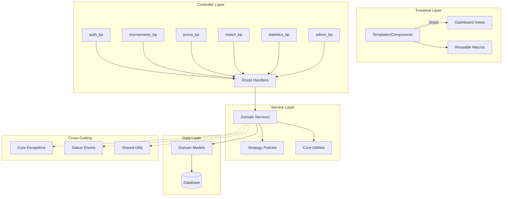

# Billiards Tournament Refactoring Design

## Overview

This document outlines a comprehensive refactoring strategy for the **tornei-biliardo** Flask webapp to address technical debt, improve maintainability, and establish a clean, modular architecture.

### Current State

The webapp currently suffers from:
- **Monolithic files**: Large route handlers and services lacking domain separation
- **Code duplication**: Repeated logic, exceptions, and inconsistent templates
- **Template oversizing**: Templates exceeding 400 lines with inconsistent structure
- **Unused classes/utilities**: Dead code accumulation
- **Mixed concerns**: Business logic embedded in route handlers
- **Insufficient testing**: Critical flows lack adequate test coverage

### Target Architecture



## Architecture Specification

### Domain-Driven Design with Blueprints

Each domain will be organized as a self-contained module with single blueprint per domain:

```
routes/
├── auth/
│   ├── __init__.py          # auth_bp = Blueprint("auth", __name__)
│   ├── authentication.py   # from . import auth_bp
│   └── permissions.py      # @auth_bp.route(...)
├── tournaments/
│   ├── __init__.py          # tournaments_bp = Blueprint("tournaments", __name__)
│   ├── tournament_routes.py # from . import tournaments_bp
│   └── director_routes.py   # @tournaments_bp.route(...)
├── prova/
│   ├── __init__.py          # prova_bp = Blueprint("prova", __name__)
│   ├── competition_routes.py # from . import prova_bp
│   └── inscription_routes.py # @prova_bp.route(...)
├── match/
│   ├── __init__.py          # match_bp = Blueprint("match", __name__)
│   ├── match_routes.py      # from . import match_bp
│   └── results_routes.py    # @match_bp.route(...)
├── statistics/
│   ├── __init__.py          # statistics_bp = Blueprint("statistics", __name__)
│   └── classification_routes.py # from . import statistics_bp
└── admin/
    ├── __init__.py          # admin_bp = Blueprint("admin", __name__)
    ├── dashboard_routes.py  # from . import admin_bp
    └── system_routes.py     # @admin_bp.route(...)
```

### Service Layer Architecture

Services will implement clean contracts with strict separation of concerns:

```
services/
├── auth_service.py          # Authentication & authorization
├── tournament_service.py    # Tournament lifecycle management
├── prova_service.py         # Competition management
├── match_service.py         # Match operations & validation
├── classification_service.py # Ranking calculations
├── notification_service.py  # User notifications
└── scoring/
    ├── __init__.py
    ├── factory.py           # Policy factory
    ├── base_policy.py       # ScoringPolicy interface
    ├── zero_diff_policy.py  # Traditional scoring
    ├── plus_one_policy.py   # Enhanced scoring
    └── amalfi_policy.py     # Sistema Amalfi integration
```

**Transaction Management**:
```python
# core/decorators.py
from functools import wraps
from flask import current_app
from models import db

def in_transaction(func):
    """Decorator to ensure function runs in a database transaction."""
    @wraps(func)
    def wrapper(*args, **kwargs):
        try:
            with db.session.begin():
                return func(*args, **kwargs)
        except Exception as e:
            current_app.logger.error(f"Transaction failed in {func.__name__}: {str(e)}", exc_info=True)
            raise
    return wrapper
```

### Template Component System

Unified template architecture with reusable components:

```
templates/
├── base.html                # Root layout
├── dashboard/
│   ├── unified.html         # Single dashboard template
│   ├── admin_widgets.html   # Admin-specific widgets
│   ├── director_widgets.html # Director-specific widgets
│   └── player_widgets.html  # Player-specific widgets
├── components/
│   ├── _cards.jinja         # Tournament/match cards
│   ├── _badges.jinja        # Status badges
│   ├── _empty_state.jinja   # Empty state messages
│   ├── _toolbar.jinja       # Action toolbars
│   ├── _forms.jinja         # Form components
│   └── _modals.jinja        # Modal dialogs
└── pages/
    ├── tournaments/         # Tournament-specific pages
    ├── matches/            # Match-specific pages
    └── admin/              # Admin-specific pages
```

### Template Naming Conventions

| **Convention** | **Rule** | **Example** |
|----------------|----------|-------------|
| Component files | `templates/components/_*.jinja` | `_tournament_card.jinja` |
| Macro naming | Domain prefix + function | `prova_status_badge()`, `match_result_form()` |
| File size limit | ≤ 300-400 lines per template | Split large templates into components |
| Business logic | None allowed in templates | Use ViewModels for pre-computed data |
| Partial includes | `` | Reusable UI fragments |
| Page templates | Domain-specific directories | `pages/tournaments/detail.html` |
| Widget templates | Role-specific widget files | `dashboard/admin_widgets.html` |

### Core Shared Module

Centralized utilities and cross-cutting concerns:

```
core/
├── __init__.py
├── exceptions.py            # Application exceptions
├── enums.py                # Status enums and constants
├── state_machine.py        # State transition management
├── decorators.py           # Permission decorators
├── validators.py           # Input validation
└── utils/
    ├── __init__.py
    ├── database_utils.py   # DB helpers
    ├── encryption.py       # Security utilities
    └── status_ui.py        # UI status helpers
```

### ViewModel/DTO Layer

Presentation layer objects to avoid N+1 queries and business logic in templates:

```
viewmodels/
├── __init__.py
├── base.py                 # Base ViewModel class
├── tournament_viewmodel.py # Tournament presentation data
├── prova_viewmodel.py      # Competition presentation data
├── match_viewmodel.py      # Match presentation data
└── dashboard_viewmodel.py  # Dashboard aggregated data
```

**ViewModel Implementation**:
```python
# viewmodels/base.py
from typing import Any, Dict
from datetime import datetime

class BaseViewModel:
    def to_dict(self) -> Dict[str, Any]:
        """Convert ViewModel to dictionary for template rendering."""
        return {k: v for k, v in self.__dict__.items() if not k.startswith('_')}

# viewmodels/tournament_viewmodel.py
from dataclasses import dataclass
from typing import List, Optional
from .base import BaseViewModel

@dataclass
class TournamentViewModel(BaseViewModel):
    id: int
    name: str
    tournament_type: str
    status: str  # Raw status value
    status_color: str  # Bootstrap color class
    status_icon: str  # Font Awesome icon class
    formatted_created_at: str
    prova_count: int
    active_prova_count: int
    total_players: int
    can_edit: bool
    can_delete: bool
    
    @classmethod
    def from_tournament(cls, tournament, user) -> 'TournamentViewModel':
        return cls(
            id=tournament.id,
            name=tournament.name,
            tournament_type=tournament.tournament_type,
            status=tournament.status.value,
            status_color=tournament.get_status_color(),
            status_icon=tournament.get_status_icon(),
            formatted_created_at=tournament.created_at.strftime('%d/%m/%Y %H:%M'),
            prova_count=len(tournament.provas),
            active_prova_count=sum(1 for p in tournament.provas if p.is_active),
            total_players=sum(len(p.inscriptions) for p in tournament.provas),
            can_edit=tournament.can_be_modified_by(user),
            can_delete=tournament.can_be_deleted_by(user)
        )

# viewmodels/dashboard_viewmodel.py
@dataclass
class DashboardViewModel(BaseViewModel):
    tournaments: List[TournamentViewModel]
    recent_matches: List['MatchViewModel']
    user_stats: Dict[str, int]
    notifications: List[str]
    quick_actions: List[Dict[str, str]]
    
    @classmethod
    def for_user(cls, user) -> 'DashboardViewModel':
        # Pre-compute all dashboard data with optimized queries
        tournaments = Tournament.query.filter_by(is_active=True).all()
        tournament_vms = [TournamentViewModel.from_tournament(t, user) for t in tournaments]
        
        # Other optimized queries...
        return cls(
            tournaments=tournament_vms,
            recent_matches=[],  # Pre-computed
            user_stats={'wins': 10, 'losses': 5},  # Pre-computed
            notifications=[],  # Pre-computed
            quick_actions=[]   # Pre-computed based on user role
        )
```

## Implementation Roadmap

**Code Examples Disclaimer**: All code snippets in this document are illustrative examples for architectural guidance. Actual implementation may vary based on specific requirements and should not be considered binding specifications.

**ADR Numbering Convention**:
- ADR-0001: Refactoring Roadmap
- ADR-0002: Route Blueprint Decomposition  
- ADR-0003: Dashboard Unification & UI Components
- ADR-0004: Service Layer Implementation
- ADR-0005: Scoring Strategy Pattern
- ADR-0006: State Machine Management
- ADR-0007: Core Cleanup & Shared Utilities

### Milestone 0: Inventory & Planning

**Objective**: Establish baseline metrics and create detailed implementation plan.

**Deliverables**:
- Complete codebase analysis report in `docs/refactor/INVENTORY.md`
- Technical debt assessment with quantified metrics
- ADR-0001 "Refactoring Roadmap" with decision rationale

**Key Metrics to Collect**:
- Files > 400 lines (routes, services, templates)
- Direct `db.session` usage count in routes
- Code duplication instances (classes, exceptions, helpers)
- Unreferenced classes and dead code
- Cyclomatic complexity for top 20 methods
- Current test coverage gaps

**Analysis Tools**:
```bash
# File size analysis
find . -name "*.py" -exec wc -l {} + | sort -n

# Database session usage in routes
grep -r "db\.session" routes/ --include="*.py"

# Dead code detection
vulture . --exclude=venv/

# Complexity analysis
radon cc . --min=B --show-complexity
```

### Milestone 1: Mechanical Route Splitting

**Objective**: Decompose monolithic route files into domain-specific blueprints without changing behavior.

**Target Files**:
- `routes/admin.py` (1443 lines) → domain-specific modules
- `routes/main.py` → public routes
- `routes/player.py` → player-specific routes

**Implementation Strategy**:

1. **Create Blueprint Structure**:
```python
# routes/admin/__init__.py
from flask import Blueprint

admin_bp = Blueprint('admin', __name__, url_prefix='/admin')

# Import route modules to register routes with admin_bp
from . import tournament_routes, prova_routes, match_routes, user_routes
```

```python
# routes/admin/tournament_routes.py
from . import admin_bp
from flask import render_template, request, redirect, url_for

@admin_bp.route('/tournaments')
def list_tournaments():
    # Route implementation
    pass

@admin_bp.route('/tournament/<int:tournament_id>')
def tournament_detail(tournament_id):
    # Route implementation
    pass
```

2. **Preserve Existing Logic**:
- Keep all `db.session` usage unchanged (temporary)
- Maintain identical URL patterns
- Preserve decorator chains and permissions

3. **Testing Requirements**:
- Smoke tests for 5-10 critical endpoints per domain
- Response status verification (200/302)
- Template name validation
- URL routing consistency tests

**Quality Gates**:
- [ ] All existing tests must pass
- [ ] No URL pattern changes - URL endpoint compatibility verified
- [ ] Response times within 10% of baseline
- [ ] Zero `db.session` usage in route files (temporary exception for Step 1)
- [ ] Templates > 400 lines identified and marked for splitting
- [ ] Smoke tests pass for all critical endpoints

**Acceptance Criteria**:
- [ ] `routes/admin.py` (1443 lines) split into domain modules
- [ ] No nested blueprint registration (single blueprint per domain)
- [ ] All route decorators and permissions preserved
- [ ] URL patterns unchanged (verified by endpoint snapshot diff)
- [ ] Blueprint registration in app.py updated correctly
- [ ] Import statements corrected to avoid circular dependencies

### Milestone 2: Dashboard Unification & Component System

**Objective**: Create unified dashboard architecture with reusable template components.

**Component Development**:

1. **Unified Dashboard Template**:
```jinja2
{# templates/dashboard/unified.html #}



<div class="dashboard-container">
    
        
    
        
    
        
    
</div>

```

2. **Reusable Macro System**:
```jinja2
{# templates/components/_badges.jinja #}

<span class="badge bg-{{ color }}">
    <i class="fas fa-{{ icon }}"></i> 
    {{ status | title }}
</span>


{# templates/components/_cards.jinja #}



<div class="card tournament-card" data-tournament-id="{{ tournament.id }}">
    <div class="card-header">
        <h5>{{ tournament.name }}</h5>
        {{ status_badge(tournament.status, tournament.status_color, tournament.status_icon) }}
    </div>
    <div class="card-body">
        
            {{ action_toolbar(tournament) }}
        
    </div>
</div>

```

3. **Template Size Reduction**:
- Break templates > 400 lines into components
- Extract repeated HTML patterns into macros
- Implement consistent styling patterns

**Migration Strategy**:
- Mark old templates as `@deprecated` with removal timeline
- Create alias templates for backward compatibility
- Document component usage patterns

### Milestone 3: Service Layer Implementation

**Objective**: Extract business logic from routes into dedicated service classes with clean contracts.

**Service Architecture**:

```python
# services/tournament_service.py
from typing import List, Optional
from core.exceptions import BusinessValidationError, PermissionError
from core.decorators import in_transaction
from models import Tournament, Prova, db

class TournamentService:
    @staticmethod
    @in_transaction
    def create_tournament(user_id: int, **kwargs) -> Tournament:
        """Create new tournament with validation."""
        if not TournamentService._can_create_tournament(user_id):
            raise PermissionError("Insufficient permissions to create tournament")
        
        tournament = Tournament(**kwargs)
        db.session.add(tournament)
        # Transaction committed automatically by decorator
        return tournament
    
    @staticmethod
    @in_transaction
    def delete_tournament(tournament_id: int) -> None:
        """Delete tournament with cascading validation."""
        tournament = Tournament.query.get_or_404(tournament_id)
        
        if not tournament.can_be_deleted():
            raise BusinessValidationError("Tournament cannot be deleted: active competitions exist")
        
        db.session.delete(tournament)
        # Transaction committed automatically by decorator
```

**Query/Command Separation**:

```python
# services/tournament_queries.py
class TournamentQueries:
    @staticmethod
    def get_active_tournaments() -> List[Tournament]:
        """Read-only tournament queries."""
        return Tournament.query.filter_by(is_active=True).all()

# services/tournament_commands.py  
class TournamentCommands:
    @staticmethod
    def activate_tournament(tournament_id: int) -> None:
        """State-changing tournament operations."""
        tournament = Tournament.query.get_or_404(tournament_id)
        tournament.is_active = True
        db.session.commit()
```

**Route Layer Simplification**:
```python
@tournaments_bp.route('/create', methods=['POST'])
@login_required
def create_tournament():
    try:
        tournament = TournamentService.create_tournament(
            user_id=current_user.id,
            **request.form.to_dict()
        )
        flash(f'Tournament "{tournament.name}" created successfully!')
        return redirect(url_for('admin.dashboard'))
    except BusinessValidationError as e:
        flash(str(e), 'error')
        return redirect(url_for('admin.dashboard'))
```

### Milestone 4: Strategy Pattern for Scoring

**Objective**: Implement configurable scoring policies using Strategy pattern.

**Policy Interface**:
```python
# services/scoring/base_policy.py
from abc import ABC, abstractmethod
from typing import List, Dict, Any
from models import Match, User

class ScoringPolicy(ABC):
    @abstractmethod
    def calculate_points(self, match: Match, player: User) -> int:
        """Calculate points for player in match."""
        pass
    
    @abstractmethod
    def handle_bye(self, player: User, round_number: int) -> int:
        """Handle bye/X scoring."""
        pass
    
    @abstractmethod
    def handle_trio(self, trio_match: 'TrioMatch', player: User) -> int:
        """Handle trio match scoring."""
        pass
```

**Concrete Implementations**:
```python
# services/scoring/zero_diff_policy.py
class ZeroDiffWinPolicy(ScoringPolicy):
    def calculate_points(self, match: Match, player: User) -> int:
        if match.winner_id == player.id:
            return 2  # Win = 2 points
        elif match.is_draw():
            return 1  # Draw = 1 point
        else:
            return 0  # Loss = 0 points

# services/scoring/amalfi_policy.py
class AmalfiScoringPolicy(ScoringPolicy):
    def calculate_points(self, match: Match, player: User) -> int:
        # Implement Sistema Amalfi scoring rules
        points = 0
        if match.winner_id == player.id:
            points = 2
            # Add rack difference bonus
            points += self._calculate_rack_bonus(match, player)
        return points
```

**Configuration Binding**:
```python
# services/scoring/factory.py
from typing import Dict
from .base_policy import ScoringPolicy
from .zero_diff_policy import ZeroDiffWinPolicy
from .plus_one_policy import PlusOneDiffPolicy
from .amalfi_policy import AmalfiScoringPolicy

_POLICIES: Dict[str, ScoringPolicy] = {
    'zero_diff': ZeroDiffWinPolicy(),
    'plus_one': PlusOneDiffPolicy(),
    'amalfi': AmalfiScoringPolicy()
}

def policy_for(slug: str) -> ScoringPolicy:
    """Get scoring policy by slug identifier."""
    if slug not in _POLICIES:
        raise ValueError(f"Unknown scoring policy: {slug}")
    return _POLICIES[slug]

def available_policies() -> Dict[str, str]:
    """Get available policy slugs with descriptions."""
    return {
        'zero_diff': 'Traditional Win/Draw/Loss',
        'plus_one': 'Enhanced Rack Difference',
        'amalfi': 'Sistema Amalfi Official'
    }
```

```python
# models/tournament/models.py
class Tournament(db.Model):
    scoring_policy = db.Column(db.String(50), default='zero_diff')
    
    # Remove get_scoring_policy method from model
```

```python
# services/tournament_service.py
from services.scoring.factory import policy_for

class TournamentService:
    @staticmethod
    def calculate_tournament_ranking(tournament_id: int):
        tournament = Tournament.query.get_or_404(tournament_id)
        policy = policy_for(tournament.scoring_policy)
        # Use policy for calculations
```

### Milestone 5: Core Cleanup & Dead Code Removal

**Objective**: Consolidate shared utilities and eliminate technical debt.

**Exception Consolidation**:
```python
# core/exceptions.py
class TorneiBiliardoError(Exception):
    """Base application exception."""
    pass

class BusinessValidationError(TorneiBiliardoError):
    """Business rule validation failed."""
    pass

class PermissionError(TorneiBiliardoError):
    """Insufficient permissions for operation."""
    pass

class InvalidTransitionError(TorneiBiliardoError):
    """Invalid state transition attempted."""
    pass
```

**Status Enum Unification**:
```python
# core/enums.py
from enum import Enum

class ProvaStatus(Enum):
    PLANNED = "planned"
    INSCRIPTION_OPEN = "inscription_open"
    INSCRIPTION_CLOSED = "inscription_closed"
    IN_PROGRESS = "in_progress"
    COMPLETED = "completed"
    CANCELLED = "cancelled"

class MatchStatus(Enum):
    SCHEDULED = "scheduled"
    IN_PROGRESS = "in_progress"
    COMPLETED = "completed"
    CANCELLED = "cancelled"
```

**State Machine Management** (ADR-0006):
```python
# core/state_machine.py
from typing import Dict, Set, TypeVar
from enum import Enum
from .enums import ProvaStatus, MatchStatus
from .exceptions import InvalidTransitionError

T = TypeVar('T', bound=Enum)

class StateMachine:
    def __init__(self, transitions: Dict[T, Set[T]]):
        self.transitions = transitions
    
    def can_transition(self, from_state: T, to_state: T) -> bool:
        return to_state in self.transitions.get(from_state, set())
    
    def validate_transition(self, from_state: T, to_state: T) -> None:
        if not self.can_transition(from_state, to_state):
            raise InvalidTransitionError(
                f"Invalid transition from {from_state.value} to {to_state.value}"
            )

class ProvaStateMachine(StateMachine):
    def __init__(self):
        transitions = {
            ProvaStatus.PLANNED: {ProvaStatus.INSCRIPTION_OPEN, ProvaStatus.CANCELLED},
            ProvaStatus.INSCRIPTION_OPEN: {ProvaStatus.INSCRIPTION_CLOSED, ProvaStatus.CANCELLED},
            ProvaStatus.INSCRIPTION_CLOSED: {ProvaStatus.IN_PROGRESS, ProvaStatus.CANCELLED},
            ProvaStatus.IN_PROGRESS: {ProvaStatus.COMPLETED, ProvaStatus.CANCELLED},
            ProvaStatus.COMPLETED: set(),  # Terminal state
            ProvaStatus.CANCELLED: set()   # Terminal state
        }
        super().__init__(transitions)

class MatchStateMachine(StateMachine):
    def __init__(self):
        transitions = {
            MatchStatus.SCHEDULED: {MatchStatus.IN_PROGRESS, MatchStatus.CANCELLED},
            MatchStatus.IN_PROGRESS: {MatchStatus.COMPLETED, MatchStatus.CANCELLED},
            MatchStatus.COMPLETED: set(),  # Terminal state
            MatchStatus.CANCELLED: set()   # Terminal state
        }
        super().__init__(transitions)

# Global instances
PROVA_STATE_MACHINE = ProvaStateMachine()
MATCH_STATE_MACHINE = MatchStateMachine()
```

**Dead Code Detection**:
```python
# scripts/detect_dead_code.py
import ast
import os
from typing import Set, List

def find_unused_classes() -> List[str]:
    """Identify unreferenced classes."""
    # Implementation for static analysis
    pass

def find_unused_imports() -> List[str]:
    """Identify unused imports."""
    # Implementation for import analysis
    pass
```

## Quality Assurance Framework

### Testing Requirements

**Coverage Targets**:
- Unit tests: ≥ 90% coverage on modified files
- Integration tests: Critical user flows
- Smoke tests: All route endpoints

**Test Structure**:
```python
# tests/services/test_tournament_service.py
class TestTournamentService:
    def test_create_tournament_success(self):
        """Test successful tournament creation."""
        pass
    
    def test_create_tournament_insufficient_permissions(self):
        """Test permission validation."""
        pass
    
    def test_delete_tournament_with_active_competitions(self):
        """Test business rule validation."""
        pass
```

**Performance Testing**:
```python
# tests/performance/test_response_times.py
import pytest
from flask import url_for

def test_dashboard_load_time(client, benchmark):
    """Ensure dashboard loads within 2 seconds using pytest-benchmark."""
    def load_dashboard():
        return client.get('/admin/dashboard')
    
    result = benchmark(load_dashboard)
    assert result.status_code == 200
    # pytest-benchmark automatically validates timing

def test_amalfi_algorithm_performance(benchmark):
    """Benchmark Amalfi pairing algorithm with 20+ players."""
    from amalfi.engine import get_amalfi_classification
    
    # Setup 20 players with match history
    players = create_test_players(20)
    
    def run_amalfi():
        return get_amalfi_classification(players)
    
    result = benchmark(run_amalfi)
    assert len(result) == 20
```

**Performance CI Integration**:
```yaml
# .github/workflows/performance.yml
name: Performance Tests
on: [pull_request]

jobs:
  performance:
    runs-on: ubuntu-latest
    steps:
      - uses: actions/checkout@v2
      - name: Download baseline
        run: |
          # Download baseline.json from main branch artifacts or generate initial baseline
          if ! gh api repos/:owner/:repo/actions/artifacts --jq '.artifacts[] | select(.name=="baseline") | .archive_download_url' | head -1 | xargs wget -O baseline.zip; then
            echo "No baseline found, generating initial baseline"
            pytest tests/performance/ --benchmark-json=baseline.json --benchmark-only
            echo "BASELINE_GENERATED=true" >> $GITHUB_ENV
          else
            unzip baseline.zip
          fi
      - name: Run performance tests
        run: |
          pytest tests/performance/ --benchmark-json=benchmark.json
      - name: Compare with baseline
        if: env.BASELINE_GENERATED != 'true'
        run: |
          pytest-benchmark compare --group-by=name baseline.json benchmark.json
      - name: Upload new baseline
        if: github.ref == 'refs/heads/main'
        uses: actions/upload-artifact@v2
        with:
          name: baseline
          path: benchmark.json
```

**Local Baseline Setup**:
```bash
# Generate initial baseline on main branch
git checkout main
pytest tests/performance/ --benchmark-json=baseline.json --benchmark-only
git add baseline.json
git commit -m "Add performance baseline"

# Compare on feature branch
git checkout feature-branch
pytest tests/performance/ --benchmark-json=current.json
pytest-benchmark compare --group-by=name baseline.json current.json
```

### Code Quality Standards

**Linting Configuration**:
```ini
# .flake8
[flake8]
max-line-length = 88
exclude = venv/,migrations/
ignore = E203,W503

# pyproject.toml
[tool.black]
line-length = 88
target-version = ['py38']
```

**Coverage on Modified Files Only**:
```yaml
# .github/workflows/ci.yml
name: CI
on: [pull_request]

jobs:
  test:
    runs-on: ubuntu-latest
    steps:
      - uses: actions/checkout@v2
        with:
          fetch-depth: 0  # Fetch full history for diff-cover
      - name: Run tests with coverage
        run: |
          pytest --cov=. --cov-report=xml
      - name: Check diff coverage
        run: |
          diff-cover coverage.xml --compare-branch=origin/main --fail-under=90
```

```bash
# Local development usage
pip install diff-cover
pytest --cov=. --cov-report=xml
diff-cover coverage.xml --compare-branch=main --fail-under=90
```

**Type Checking**:
```python
# All service methods must include type hints
def create_tournament(
    user_id: int, 
    name: str, 
    tournament_type: str = "Amalfi"
) -> Tournament:
    pass
```

### Error Handling Standards

**Route Error Handling**:
```python
@tournaments_bp.route('/delete/<int:tournament_id>', methods=['POST'])
@login_required
def delete_tournament(tournament_id: int):
    try:
        TournamentService.delete_tournament(tournament_id)
        flash('Tournament deleted successfully!')
    except BusinessValidationError as e:
        flash(str(e), 'error')
    except PermissionError as e:
        flash('Insufficient permissions', 'error')
    except Exception as e:
        flash('An unexpected error occurred', 'error')
        # Log the actual error for debugging
        
    return redirect(url_for('admin.dashboard'))
```

## Data Migration Strategy

### Deprecation Policy

**Deprecation Workflow**:
1. Mark code with `@deprecated` decorator and ADR reference
2. Grace period: 2 release cycles minimum
3. Create migration table mapping old → new
4. Add warnings in logs for deprecated usage
5. Remove in planned release with final warning

**Deprecation Implementation**:
```python
# core/decorators.py
import warnings
from functools import wraps
from typing import Callable, Optional

def deprecated(since: str, removal: str, alternative: Optional[str] = None):
    """Mark function as deprecated."""
    def decorator(func: Callable) -> Callable:
        @wraps(func)
        def wrapper(*args, **kwargs):
            msg = f"{func.__name__} deprecated since {since}, will be removed in {removal}"
            if alternative:
                msg += f". Use {alternative} instead."
            warnings.warn(msg, DeprecationWarning, stacklevel=2)
            return func(*args, **kwargs)
        return wrapper
    return decorator

# Usage example
@deprecated(since="ADR-0003", removal="v4.1.0", alternative="unified_dashboard")
def old_admin_dashboard():
    """Legacy admin dashboard - use unified_dashboard instead."""
    pass
```

**Migration Mapping Table**:

| **Legacy Component** | **New Component** | **Deprecated Since** | **Removal Target** | **Feature Flag** | **Migration Notes** |
|---------------------|-------------------|---------------------|--------------------|-----------------|-----------------|
| `templates/admin/dashboard.html` | `templates/dashboard/unified.html` | ADR-0003 | v4.1.0 | `UNIFIED_DASHBOARD` | Use role-based widgets |
| `templates/player/dashboard.html` | `templates/dashboard/unified.html` | ADR-0003 | v4.1.0 | `UNIFIED_DASHBOARD` | Use role-based widgets |
| `InvalidTransitionError` (multiple locations) | `core.exceptions.InvalidTransitionError` | ADR-0007 | v4.0.0 | N/A | Import from core |
| `Tournament.get_scoring_policy()` | `services.scoring.factory.policy_for()` | ADR-0005 | v4.2.0 | `SCORING_FACTORY` | Use factory pattern |
| Direct `db.session` in routes | Service layer methods | ADR-0004 | v4.0.0 | N/A | Delegate to services |

**Feature Flag Implementation**:
```python
# core/feature_flags.py
from flask import current_app
from typing import Dict, Any

class FeatureFlags:
    @staticmethod
    def is_enabled(flag_name: str) -> bool:
        """Check if a feature flag is enabled."""
        flags = current_app.config.get('FEATURE_FLAGS', {})
        return flags.get(flag_name, False)
    
    @staticmethod
    def get_flag_config() -> Dict[str, Any]:
        """Get all feature flag configurations."""
        return current_app.config.get('FEATURE_FLAGS', {})

# Usage in routes
from core.feature_flags import FeatureFlags

@admin_bp.route('/dashboard')
def dashboard():
    if FeatureFlags.is_enabled('UNIFIED_DASHBOARD'):
        return render_template('dashboard/unified.html')
    else:
        return render_template('admin/dashboard.html')  # Legacy template
```

### Database Compatibility

**Model Changes**:
- Add `scoring_policy` field to Tournament model
- Create migration scripts for new enum values
- Ensure backward compatibility during transition
- Apply deprecation policy for removed components

**URL Compatibility & Critical Endpoints**:

| **Endpoint Path** | **Expected Status** | **Template** | **Test Priority** |
|-------------------|--------------------|--------------|-----------------|
| `/admin/dashboard` | 200 | `dashboard/unified.html` | Critical |
| `/admin/tournament/<id>` | 200 | `pages/tournaments/detail.html` | Critical |
| `/admin/prova/<id>` | 200 | `pages/prova/detail.html` | Critical |
| `/admin/match/<id>` | 200 | `pages/matches/detail.html` | High |
| `/player/dashboard` | 200 | `dashboard/unified.html` | Critical |
| `/auth/login` | 200 | `auth/login.html` | Critical |
| `/auth/logout` | 302 | Redirect to login | High |
| `/api/tournaments` | 200 | JSON response | Medium |

**Smoke Test Implementation**:
```python
# tests/smoke/test_critical_endpoints.py
import pytest
from flask import template_rendered
from contextlib import contextmanager

@contextmanager
def captured_templates(app):
    """Context manager to capture templates rendered during request."""
    recorded = []
    def record(sender, template, context, **extra):
        recorded.append((template, context))
    template_rendered.connect(record, app)
    try:
        yield recorded
    finally:
        template_rendered.disconnect(record, app)

@pytest.mark.parametrize("endpoint,expected_status,expected_template", [
    ('/admin/dashboard', 200, 'dashboard/unified.html'),
    ('/admin/tournament/1', 200, 'pages/tournaments/detail.html'),
    ('/admin/prova/1', 200, 'pages/prova/detail.html'),
    ('/admin/match/1', 200, 'pages/matches/detail.html'),
    ('/player/dashboard', 200, 'dashboard/unified.html'),
    ('/auth/login', 200, 'auth/login.html'),
    ('/auth/logout', 302, None),  # Redirect, no template
])
def test_critical_endpoint_availability(app, client, endpoint, expected_status, expected_template):
    """Test critical endpoints for availability and correct template usage."""
    with captured_templates(app) as templates:
        response = client.get(endpoint)
        
    assert response.status_code == expected_status
    
    if expected_template and expected_status == 200:
        assert len(templates) > 0, f"No template rendered for {endpoint}"
        rendered_template = templates[0][0].name
        assert rendered_template == expected_template, \
            f"Expected {expected_template}, got {rendered_template} for {endpoint}"
```

**Migration Script Example**:
```python
# migrations/add_scoring_policy.py
def upgrade():
    """Add scoring_policy column to tournaments."""
    op.add_column('tournament', 
        sa.Column('scoring_policy', sa.String(50), 
                  nullable=False, server_default='zero_diff'))

def downgrade():
    """Remove scoring_policy column."""
    op.drop_column('tournament', 'scoring_policy')
```

### URL Compatibility

**Endpoint Preservation**:
- Maintain all existing URL patterns
- Use route aliases for deprecated endpoints
- Document any required URL changes in ADRs

## Risk Assessment & Mitigation

### Observability & Error Management

**Structured Logging Implementation**:
```python
# core/logging.py
import logging
import uuid
from flask import g, request, current_app
from flask_login import current_user
from typing import Optional

class CorrelationFilter(logging.Filter):
    def filter(self, record):
        record.correlation_id = getattr(g, 'correlation_id', 'unknown')
        record.user_id = getattr(g, 'user_id', 'anonymous')
        return True

def setup_logging(app):
    """Configure structured logging for the application."""
    # Configure structured logging
    formatter = logging.Formatter(
        '%(asctime)s [%(levelname)s] %(correlation_id)s - %(user_id)s - %(message)s'
    )
    
    handler = logging.StreamHandler()
    handler.setFormatter(formatter)
    handler.addFilter(CorrelationFilter())
    
    app.logger.addHandler(handler)
    app.logger.setLevel(logging.INFO)
    
    # Register request hooks
    @app.before_request
    def before_request():
        g.correlation_id = str(uuid.uuid4())[:8]
        if current_user.is_authenticated:
            g.user_id = current_user.id
        else:
            g.user_id = 'anonymous'
```

**Application Factory Integration**:
```python
# app.py
from core.logging import setup_logging
from core.error_handlers import register_error_handlers

def create_app(config_name='development'):
    app = Flask(__name__)
    
    # Configure logging early
    setup_logging(app)
    
    # Register error handlers
    register_error_handlers(app)
    
    # Register blueprints in order
    from routes.auth import auth_bp
    from routes.admin import admin_bp
    from routes.tournaments import tournaments_bp
    from routes.prova import prova_bp
    from routes.match import match_bp
    from routes.statistics import statistics_bp
    
    app.register_blueprint(auth_bp)
    app.register_blueprint(admin_bp)
    app.register_blueprint(tournaments_bp)
    app.register_blueprint(prova_bp)
    app.register_blueprint(match_bp)
    app.register_blueprint(statistics_bp)
    
    return app
```

**Error Taxonomy & Response Mapping**:

| **Exception Type** | **Log Level** | **Flash Message** | **HTTP Code** | **User Action** |
|-------------------|---------------|-------------------|---------------|----------------|
| `BusinessValidationError` | WARNING | Error message from exception | 400 | Show form errors, redirect |
| `PermissionError` | WARNING | "Insufficient permissions" | 403 | Redirect to dashboard |
| `InvalidTransitionError` | WARNING | "Invalid operation for current state" | 400 | Show current state, suggest actions |
| `IntegrityError` | ERROR | "Data conflict detected" | 409 | Suggest refresh, retry |
| `NotFound` (404) | INFO | "Resource not found" | 404 | Redirect to list view |
| `Exception` (unexpected) | ERROR | "An unexpected error occurred" | 500 | Show generic error, log details |

**Service Layer Logging Standards**:
```python
# services/tournament_service.py
class TournamentService:
    @staticmethod
    def create_tournament(user_id: int, **kwargs) -> Tournament:
        logger = current_app.logger
        
        try:
            logger.info(f"Creating tournament for user {user_id}")
            
            if not TournamentService._can_create_tournament(user_id):
                logger.warning(f"User {user_id} attempted tournament creation without permissions")
                raise PermissionError("Insufficient permissions to create tournament")
            
            tournament = Tournament(**kwargs)
            db.session.add(tournament)
            db.session.commit()
            
            logger.info(f"Tournament {tournament.id} created successfully by user {user_id}")
            return tournament
            
        except Exception as e:
            logger.error(f"Unexpected error creating tournament: {str(e)}", exc_info=True)
            db.session.rollback()
            raise
```

**Centralized Error Handler**:
```python
# core/error_handlers.py
from flask import flash, redirect, url_for, request, current_app
from core.exceptions import BusinessValidationError, PermissionError, InvalidTransitionError

def register_error_handlers(app):
    @app.errorhandler(BusinessValidationError)
    def handle_business_error(error):
        flash(str(error), 'error')
        return redirect(request.referrer or url_for('admin.dashboard'))
    
    @app.errorhandler(PermissionError)
    def handle_permission_error(error):
        current_app.logger.warning(f"Permission denied: {str(error)}")
        flash('Insufficient permissions for this operation', 'error')
        return redirect(url_for('admin.dashboard'))
    
    @app.errorhandler(500)
    def handle_server_error(error):
        current_app.logger.error(f"Server error: {str(error)}", exc_info=True)
        flash('An unexpected error occurred. Please try again.', 'error')
        return redirect(url_for('admin.dashboard'))
```

### Technical Risks

1. **Blueprint Registration Issues**
   - **Risk**: Circular imports during blueprint registration
   - **Mitigation**: Use application factory pattern, lazy imports
   - **Detection**: Automated import testing

2. **Template Compatibility**
   - **Risk**: Broken template inheritance during componentization
   - **Mitigation**: Incremental migration, backward compatibility aliases
   - **Detection**: Template rendering tests

3. **Service Layer Transaction Management**
   - **Risk**: Inconsistent transaction boundaries
   - **Mitigation**: Explicit transaction decorators, rollback testing
   - **Detection**: Database integrity tests

### Operational Risks

1. **Performance Degradation**
   - **Risk**: Service layer overhead affecting response times
   - **Mitigation**: Performance benchmarking, query optimization
   - **Detection**: Automated performance tests

2. **Feature Regression**
   - **Risk**: Breaking existing functionality during refactoring
   - **Mitigation**: Comprehensive test suite, feature flag rollbacks
   - **Detection**: End-to-end testing pipeline

## Documentation Standards

### Architecture Decision Records (ADRs)

**Template Structure**:
```markdown
# ADR-NNNN: Decision Title

## Status
Proposed | Accepted | Deprecated | Superseded

## Context
What is the issue that we're seeing that is motivating this decision?

## Decision
What is the change that we're proposing or have agreed to implement?

## Consequences
What becomes easier or more difficult to do because of this change?

## Alternatives Considered
What other options were evaluated?

## Implementation Plan
How will this decision be implemented?
```

### Step Documentation

**Progress Tracking**:
```markdown
# docs/refactor/STEP-N.md

## Changes Made
- Files created: [list]
- Files modified: [list] 
- Files removed: [list]

## Metrics
- Lines of code: Before/After
- Duplications removed: Count
- Complexity reduction: Cyclomatic complexity changes

## Risks & Residuals
- Known issues remaining
- Technical debt still present

## Next Actions
- Dependencies for next milestone
- Required reviews/approvals
```

## Implementation Guidelines

### Development Workflow

**Branch Strategy**:
```bash
git checkout -b refactor/step-N-description
# Make changes
git commit -m "refactor(step-N): specific change"
git push origin refactor/step-N-description
# Create PR with ADR links
```

**Quality Gates**:
- [ ] Coverage ≥ 90% on modified files
- [ ] `pytest -q` passes
- [ ] `flake8` and `black --check` pass
- [ ] Performance tests within 2s p95
- [ ] No foreign key violations
- [ ] User-friendly error messages with flash()
- [ ] Zero `db.session` usage in routes (except Step 1)

### Code Review Checklist

**Service Layer Review**:
- [ ] Single responsibility principle followed
- [ ] Proper exception handling with application exceptions
- [ ] Transaction boundaries clearly defined
- [ ] Type hints on all public methods
- [ ] Input validation implemented

**Template Review**:
- [ ] Components properly parameterized
- [ ] No business logic in templates
- [ ] Consistent styling patterns
- [ ] Accessibility considerations
- [ ] Mobile responsiveness maintained

**Route Review**:
- [ ] Minimal logic, delegates to services
- [ ] Proper permission decorators
- [ ] User-friendly error handling
- [ ] Consistent flash messaging
- [ ] No direct database access

This refactoring design provides a comprehensive roadmap for transforming the billiards tournament webapp into a maintainable, scalable, and well-architected application while preserving all existing functionality and ensuring smooth incremental delivery.

## Security & Access Control

### RBAC Matrix

Role-based access control matrix for the application (documented in `docs/security/RBAC.md`):

| **Action** | **Admin** | **Director** | **Player** | **Anonymous** | **Notes** |
|------------|-----------|--------------|------------|---------------|--------|
| **Tournament Management** |
| Create Tournament | ✅ | ✅ | ❌ | ❌ | Directors can create tournaments |
| Edit Tournament | ✅ | ✅* | ❌ | ❌ | *Only assigned directors |
| Delete Tournament | ✅ | ✅* | ❌ | ❌ | *Only if no active provas |
| View Tournament | ✅ | ✅ | ✅ | ✅ | Public information |
| Assign Directors | ✅ | ✅* | ❌ | ❌ | *Only tournament creators |
| **Competition (Prova) Management** |
| Create Prova | ✅ | ✅* | ❌ | ❌ | *Within assigned tournaments |
| Edit Prova | ✅ | ✅* | ❌ | ❌ | *Before inscription close |
| Delete Prova | ✅ | ✅* | ❌ | ❌ | *If no inscriptions |
| Start/Stop Inscriptions | ✅ | ✅* | ❌ | ❌ | *Prova managers only |
| Generate Pairings | ✅ | ✅* | ❌ | ❌ | *Using Amalfi algorithm |
| **Match Management** |
| Create Match | ✅ | ✅* | ❌ | ❌ | *Via pairing generation |
| Input Results | ✅ | ✅* | ❌ | ❌ | *Rack-by-rack input |
| Edit Results | ✅ | ✅* | ❌ | ❌ | *With audit trail |
| Confirm Results | ✅ | ✅* | ✅* | ❌ | *Players confirm own matches |
| **User Management** |
| Create Users | ✅ | ❌ | ❌ | ❌ | Admin-only privilege |
| Promote to Director | ✅ | ❌ | ❌ | ❌ | Admin approval required |
| View User Profiles | ✅ | ✅ | ✅* | ❌ | *Own profile + public data |
| Delete Users | ✅ | ❌ | ✅* | ❌ | *Self-deletion only |
| **System Administration** |
| Reset Database | ✅ | ❌ | ❌ | ❌ | Development/debug only |
| View Audit Logs | ✅ | ✅* | ❌ | ❌ | *Limited to own tournaments |
| System Configuration | ✅ | ❌ | ❌ | ❌ | Admin-only privilege |

**Permission Implementation**:
```python
# core/permissions.py
from enum import Enum
from typing import Callable, Optional
from flask_login import current_user
from models import Tournament, Prova, Match

class Permission(Enum):
    CREATE_TOURNAMENT = "create_tournament"
    EDIT_TOURNAMENT = "edit_tournament"
    DELETE_TOURNAMENT = "delete_tournament"
    MANAGE_PROVA = "manage_prova"
    INPUT_RESULTS = "input_results"
    SYSTEM_ADMIN = "system_admin"

class PermissionChecker:
    @staticmethod
    def can_manage_tournament(user, tournament_id: int) -> bool:
        if user.is_admin:
            return True
        if user.is_director:
            tournament = Tournament.query.get(tournament_id)
            return tournament and user.id in [td.user_id for td in tournament.directors_association]
        return False
    
    @staticmethod
    def can_manage_prova(user, prova_id: int) -> bool:
        if user.is_admin:
            return True
        prova = Prova.query.get(prova_id)
        if prova:
            return PermissionChecker.can_manage_tournament(user, prova.tournament_id)
        return False
```