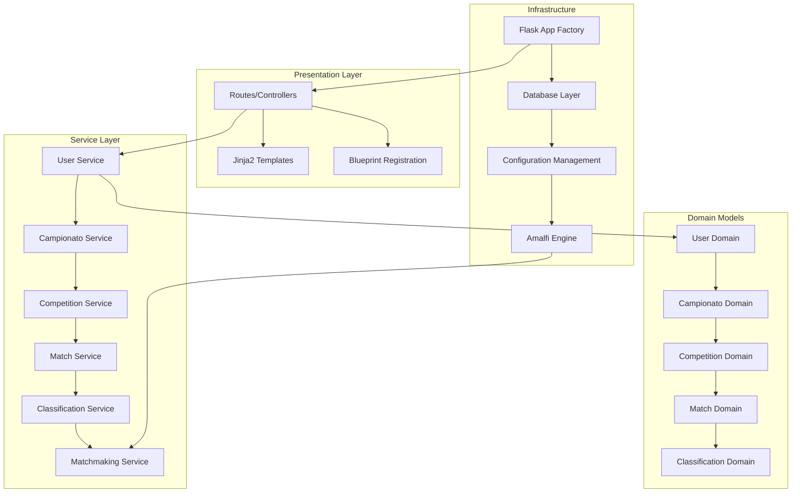
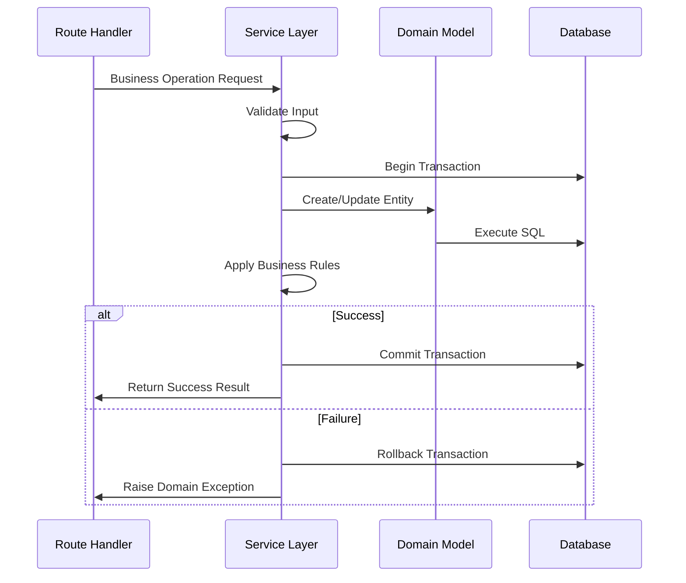
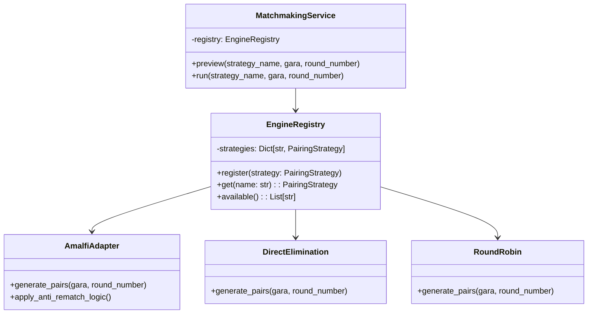
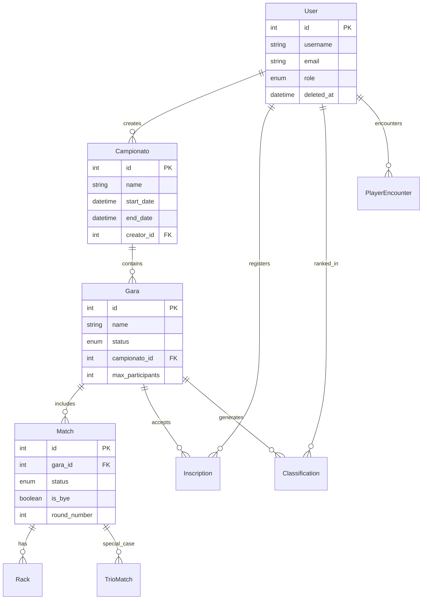
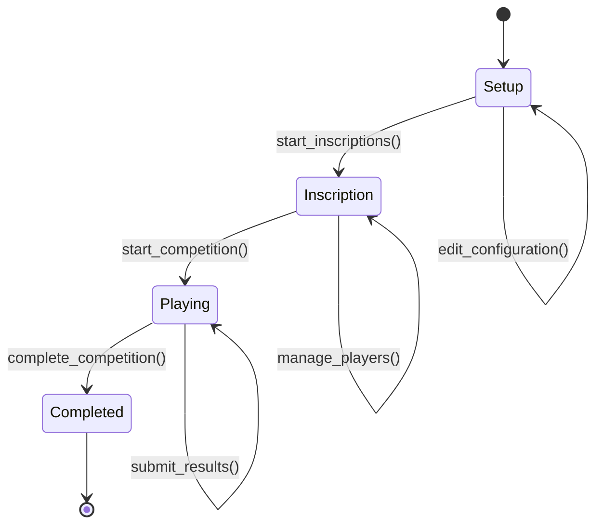
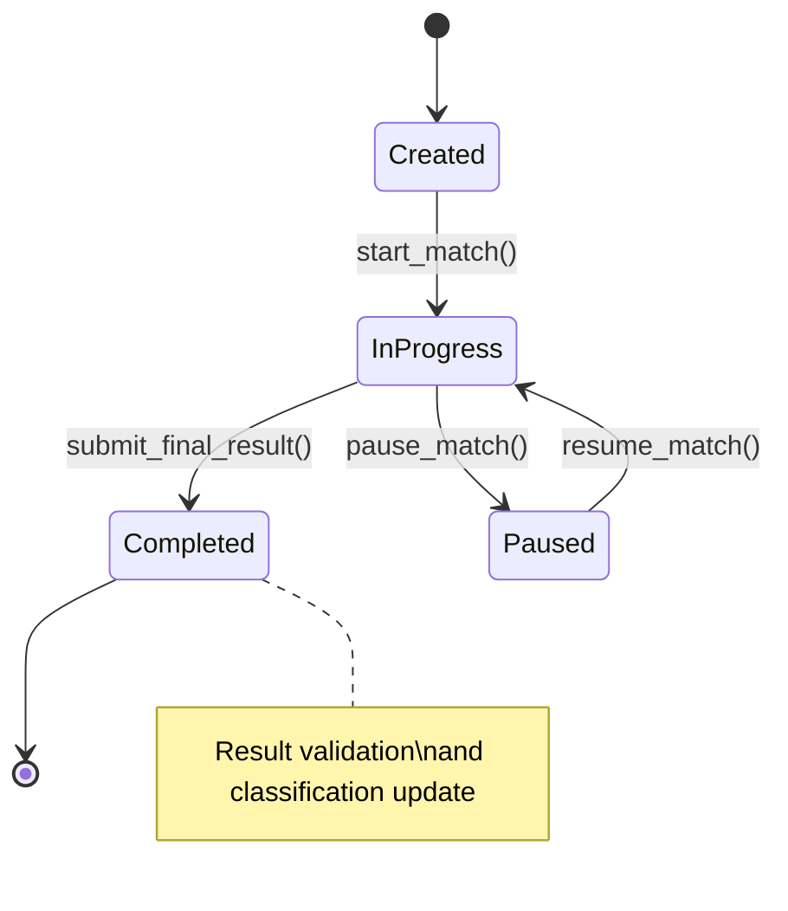

# Code Refactoring Design - Campionati Biliardo

## Overview

The campionati-biliardo project is a comprehensive Flask-based web application for managing billiards campionati using the official Sistema Amalfi pairing algorithm. This refactoring initiative focuses on advancing the current domain-driven design implementation, improving service layer architecture, and enhancing modularity while maintaining backward compatibility.

**Current State**: The application has successfully completed Phase 2 Sprint 1 of domain separation, with core domains (User, Campionato, Competition, Match, Classification) properly modularized and service layers implemented.

**Refactoring Goals**:
- Complete domain separation and service layer optimization
- Enhance modularity and maintainability
- Improve code organization and reduce technical debt
- Strengthen architectural boundaries
- Optimize performance and scalability

## Technology Stack & Dependencies

**Backend Framework**: Flask 2.3.3 with Blueprint-based modular architecture
**ORM**: Flask-SQLAlchemy 3.0.5 with domain-driven model organization
**Authentication**: Flask-Login 0.6.3 with role-based access control
**Database**: SQLite (development) / PostgreSQL (production)
**Testing**: Pytest with comprehensive domain and integration testing
**Frontend**: Jinja2 templates with Bootstrap 5 responsive design

**Key Dependencies**:
- Werkzeug 2.3.7 for WSGI utilities
- Custom Amalfi algorithm engine for campionato pairing
- Soft delete filtering for data integrity
- Multi-domain service orchestration

## Architecture

### Current Architecture Pattern



### Domain Organization

The application follows a Domain-Driven Design (DDD) approach with clear bounded contexts:

**Core Domains** (Phase 2 Complete):
- **User Domain**: Authentication, role management, director promotion system
- **Campionato Domain**: Campionato lifecycle and administrative interface
- **Competition Domain**: Gara (competition) management and player inscription
- **Match Domain**: Match lifecycle, result recording, trio match handling
- **Classification Domain**: Campionato standings and anti-rematch logic

**Extended Domains** (Phase 3 Implementation):
- **Challenge Domain**: Individual skill challenges and favorites
- **Exam Domain**: Certification and testing system
- **Individual Match Domain**: Direct player matchmaking and proposals
- **Playoff Domain**: Campionato playoff configuration and management
- **Rating Domain**: Player categorization and handicap system
- **Notification Domain**: Communication and alert system
- **Location Domain**: Billiard hall management and availability
- **Tiebreaker Domain**: Advanced tiebreaker mechanisms

### Service Layer Architecture

#### Transaction Management Strategy



#### Service Layer Responsibilities

**Separation of Concerns**:
- Routes handle HTTP request/response mapping
- Services encapsulate all business logic and domain rules
- Models define data structure and basic validations
- Database operations are isolated within service boundaries

**Transaction Boundaries**:
```python
# Pattern: Explicit transaction management in services
try:
    with db.session.begin():
        # Business logic operations
        user = self._create_user_entity(validated_data)
        self._enforce_admin_uniqueness(user.role)
        db.session.add(user)
        return user
except IntegrityError:
    # Service-level exception handling
    raise ValueError("User creation failed: duplicate constraint")
```

## Component Architecture

### Domain Service Implementation

#### User Service Layer
**Responsibilities**:
- User creation with role-based validation
- Admin uniqueness enforcement
- Director promotion workflow
- Soft delete and data cleanup

**Key Business Rules**:
- Single active administrator constraint
- Director promotion requires approval
- Cascade delete with audit trail preservation

#### Campionato Service Layer
**Responsibilities**:
- Campionato lifecycle management
- Multi-campionato support with timezone handling
- Administrative interface operations
- Resource cleanup and integrity maintenance

#### Competition Service Layer
**Responsibilities**:
- Gara state machine management (setup → inscription → playing → completed)
- Player inscription and withdrawal handling
- Automatic trio formation for odd player counts
- Result validation and consistency checks

#### Match Service Layer
**Responsibilities**:
- Match creation and pairing management
- Result submission and validation
- State transition enforcement
- Trio match special handling

#### Classification Service Layer
**Responsibilities**:
- Real-time ranking calculations
- Anti-rematch enforcement through PlayerEncounter tracking
- Multi-criteria sorting (wins → rack difference → previous order)
- Campionato standings generation

#### Matchmaking Service Layer
**Responsibilities**:
- Strategy pattern orchestration for pairing algorithms
- Amalfi algorithm integration and binding
- Preview functionality for match generation
- Policy enforcement and validation

### Strategy Pattern Implementation



### Database Design and Relationships



## Routing & Navigation

### Blueprint Organization

**Modular Route Structure**:
- `/auth` - Authentication and user registration
- `/admin` - Administrative operations and management
- `/player` - Player-specific features and profile management
- `/dashboard` - Role-based dashboard views
- `/` - Public routes and main campionato display

**Route-Service Integration Pattern**:
```python
# Example: Admin route delegating to service layer
@admin_bp.route('/campionati/<int:campionato_id>/delete', methods=['POST'])
@admin_required
def delete_campionato(campionato_id):
    try:
        result = TournamentService.delete_campionato(campionato_id, current_user.id)
        return jsonify({"success": True, "message": result["message"]})
    except ValueError as e:
        return jsonify({"success": False, "error": str(e)}), 400
```

### URL Design Patterns

**RESTful Resource Mapping**:
- `GET /admin/campionati` - List campionati
- `POST /admin/campionati` - Create campionato
- `GET /admin/campionati/{id}` - View campionato details
- `PUT /admin/campionati/{id}` - Update campionato
- `DELETE /admin/campionati/{id}` - Delete campionato

**Action-Oriented Endpoints**:
- `POST /admin/provas/{id}/start` - Transition gara to playing state
- `POST /admin/matches/{id}/submit-result` - Submit match result
- `GET /player/matches/preview` - Preview upcoming matches

## State Management

### Competition State Machine



**State Transition Rules**:
- Setup → Inscription: Requires minimum configuration
- Inscription → Playing: Requires minimum player count
- Playing → Completed: All matches must be completed
- Backward transitions are not permitted

### Match Lifecycle Management



## API Integration Layer

### Service-to-Service Communication

**Internal Service Orchestration**:
```python
class MatchmakingService:
    def create_new_round(self, gara_id: int, strategy_name: str) -> dict:
        # Service orchestration example
        gara = CompetitionService.get_gara(gara_id)
        classification = ClassificationService.get_current_standings(gara_id)
        pairings = self.generate_pairings(strategy_name, gara, classification)
        matches = MatchService.create_matches_from_pairings(pairings)
        return {"round_number": gara.current_round, "matches": matches}
```

### External System Integration Points

**Amalfi Algorithm Integration**:
- Binding layer connects domain models to algorithm engine
- Strategy adapter pattern for algorithm extensibility
- Performance optimization with <1 second execution time

**Database Integration Patterns**:
- Repository pattern abstraction through SQLAlchemy ORM
- Soft delete implementation for data integrity
- Bulk operations for performance optimization

## Testing Strategy

### Service Layer Testing

**Unit Testing Approach**:
```python
class TestUserService:
    def test_create_admin_enforces_uniqueness(self):
        # Test business rule enforcement
        UserService.create_user(admin_data_1)
        with pytest.raises(ValueError, match="amministratore attivo"):
            UserService.create_user(admin_data_2)
    
    def test_director_promotion_workflow(self):
        # Test complex business process
        request = UserService.request_director_promotion(user_id)
        assert request.status == "pending"
        UserService.approve_director_request(request.id, admin_id)
        assert User.query.get(user_id).is_director
```

**Integration Testing Strategy**:
- End-to-end campionato workflow validation
- Cross-domain service interaction testing
- Database transaction boundary verification
- Performance testing for Amalfi algorithm execution

### Architecture Boundary Testing

**Contract Testing**:
- Service interface validation
- Domain boundary enforcement
- Route-service delegation verification
- Model relationship integrity

## Performance Considerations

### Service Layer Optimization

**Transaction Scope Management**:
- Minimize transaction duration
- Batch operations for bulk data processing
- Lazy loading for related entities

**Query Optimization Strategies**:
```python
# Prevent N+1 query problems
def get_campionato_with_garas(campionato_id):
    return Campionato.query.options(
        joinedload(Campionato.provas).joinedload(Gara.matches)
    ).get(campionato_id)
```

**Caching Opportunities**:
- Campionato classification caching
- User permission role caching
- Static configuration data caching

### Scalability Considerations

**Database Performance**:
- Indexed foreign key relationships
- Optimized queries for large datasets
- Connection pooling for concurrent users

**Memory Management**:
- Efficient data structure usage in Amalfi algorithm
- Pagination for large result sets
- Session cleanup and garbage collection