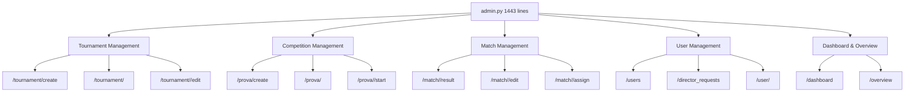

# Refactoring Progress Review & Next Steps

## Overview

This document reviews the current state of the tornei-biliardo refactoring project and defines the immediate next steps to continue the comprehensive refactoring roadmap established in ADR-0001.

## Current Progress Assessment

### Step 0: Inventory & Planning ✅ COMPLETED
**Status**: Fully completed as of 2025-08-24  
**Artifacts Created**:
- `docs/refactor/INVENTORY.md` - Comprehensive technical debt assessment
- `docs/adr/ADR-0001-refactoring-roadmap.md` - Architectural decision record
- `docs/refactor/README.md` - Documentation structure guide
- `docs/refactor/STEP-0.md` - Milestone completion report

**Key Findings Confirmed**:
- Monolithic `routes/admin.py` at 1,443 lines (critical priority)
- 39+ direct `db.session` calls in route files
- Template complexity with 5 files >400 lines
- Code duplication (`InvalidTransitionError`)
- Minimal test coverage (2 test files)

### Next Milestone: Step 1 - Route Blueprint Decomposition
**Status**: ❌ **NOT STARTED**  
**Current State**: Repository analysis shows no implementation progress on Step 1

**Evidence**:
- `routes/admin.py` still contains 1,443 lines (unchanged from inventory)
- No new ADR documents created for Step 1 decisions
- No domain-specific blueprint modules created
- No implementation branches found

## Step 1 Implementation Plan

### Objective
Split the monolithic `routes/admin.py` file into domain-specific blueprints while preserving all existing URLs and functionality.

### Technical Approach

#### 1. Domain Decomposition Strategy
Based on the current `admin.py` analysis, identify these domain boundaries:



#### 2. Blueprint Architecture
Create domain-specific blueprint modules:

- `routes/admin/tournament.py` - Tournament lifecycle management
- `routes/admin/competition.py` - Prova (competition) management  
- `routes/admin/match.py` - Match and result management
- `routes/admin/user.py` - User administration
- `routes/admin/dashboard.py` - Admin dashboard views
- `routes/admin/__init__.py` - Blueprint registration and URL assembly

#### 3. URL Preservation Strategy
Maintain existing URL structure through blueprint prefixes:

```python
# routes/admin/__init__.py
from flask import Blueprint

# Main admin blueprint (parent)
admin_bp = Blueprint('admin', __name__, url_prefix='/admin')

# Domain sub-blueprints
from .tournament import tournament_bp
from .competition import competition_bp  
from .match import match_bp
from .user import user_bp
from .dashboard import dashboard_bp

# Register sub-blueprints with preserved URLs
admin_bp.register_blueprint(tournament_bp, url_prefix='/tournament')
admin_bp.register_blueprint(competition_bp, url_prefix='/prova')  
admin_bp.register_blueprint(match_bp, url_prefix='/match')
admin_bp.register_blueprint(user_bp, url_prefix='/user')
admin_bp.register_blueprint(dashboard_bp)
```

### Implementation Steps

#### Phase 1.1: Blueprint Structure Creation
1. Create `routes/admin/` directory
2. Create domain-specific blueprint files
3. Set up blueprint registration in `__init__.py`
4. Create mechanical route extraction (copy-paste with minimal changes)

#### Phase 1.2: Route Migration
1. **Tournament Routes** (Lines ~50-200 in admin.py)
   - `/tournament/create` 
   - `/tournament/<id>`
   - `/tournament/<id>/edit`
   - `/tournament/<id>/delete`
   - `/tournament/<id>/toggle_active`
   - `/tournament/<id>/add_director`

2. **Competition Routes** (Lines ~200-800 in admin.py) 
   - `/prova/create`
   - `/prova/<id>`
   - `/prova/<id>/start`
   - `/prova/<id>/inscribe`
   - `/prova/<id>/withdraw`

3. **Match Routes** (Lines ~800-1200 in admin.py)
   - `/match/<id>/result`
   - `/match/<id>/edit`
   - `/match/<id>/assign`

4. **User Routes** (Lines ~1200-1400 in admin.py)
   - `/users`
   - `/director_requests`
   - `/user/<id>`

5. **Dashboard Routes** (Lines ~1-50 in admin.py)
   - `/` (dashboard redirect)
   - Overview and summary views

#### Phase 1.3: Import Cleanup
1. Update import statements in each blueprint
2. Ensure all required models and services are imported
3. Clean up unused imports from original `admin.py`

#### Phase 1.4: Blueprint Registration
1. Update main `routes/__init__.py` to register new admin blueprint structure
2. Remove old monolithic admin blueprint registration
3. Test blueprint registration and URL routing

### Success Criteria
- [ ] All existing admin URLs continue to work unchanged
- [ ] `routes/admin.py` reduced to <100 lines (redirect/import only)
- [ ] 5 new domain-specific blueprint files created
- [ ] All imports and dependencies resolved correctly
- [ ] No new `db.session` calls introduced
- [ ] Smoke tests pass for critical admin functionality

### Quality Gates
- [ ] **URL Compatibility**: All 39 existing admin endpoints preserved
- [ ] **Functionality**: No behavioral changes to any admin feature
- [ ] **Architecture**: Clean blueprint separation with no circular imports
- [ ] **Performance**: No degradation in response times
- [ ] **Testing**: All existing tests continue to pass

## Next Actions Required

### Immediate Tasks (This Week)
1. **Create ADR-0002**: Document blueprint decomposition decisions
2. **Create Branch**: `refactor/step-1-admin-routes-split`
3. **Implement Phase 1.1**: Blueprint structure creation
4. **Begin Route Migration**: Start with tournament routes (lowest risk)

### Risk Mitigation
1. **URL Testing**: Create smoke tests for all 39 admin endpoints before migration
2. **Incremental Approach**: Migrate one domain at a time with testing between each
3. **Rollback Plan**: Keep original `admin.py` as `admin_backup.py` during transition
4. **Import Validation**: Verify all imports resolve correctly before committing changes

### Estimated Timeline
- **Phase 1.1**: 1 day (blueprint structure)
- **Phase 1.2**: 3 days (route migration, domain by domain)  
- **Phase 1.3**: 1 day (import cleanup)
- **Phase 1.4**: 1 day (registration and testing)
- **Total**: 6 days for complete Step 1 implementation

## Architecture Benefits

### Immediate Gains
- **Maintainability**: Domain separation makes changes easier to scope
- **Team Collaboration**: Multiple developers can work on different domains simultaneously
- **Code Review**: Smaller files are easier to review and understand
- **Testing**: Domain-specific logic easier to test in isolation

### Foundation for Future Steps
- **Step 2 Preparation**: Cleaner route structure enables better template organization
- **Step 3 Preparation**: Domain boundaries align with service layer implementation
- **Debugging**: Issues easier to locate within specific domain modules

## Conclusion

The refactoring project has completed the planning phase successfully but has not yet begun implementation. Step 1 (Route Blueprint Decomposition) should be the immediate priority, as it provides the architectural foundation for all subsequent refactoring steps. The monolithic `routes/admin.py` file represents the highest technical debt in the system and should be addressed before proceeding with other improvements.