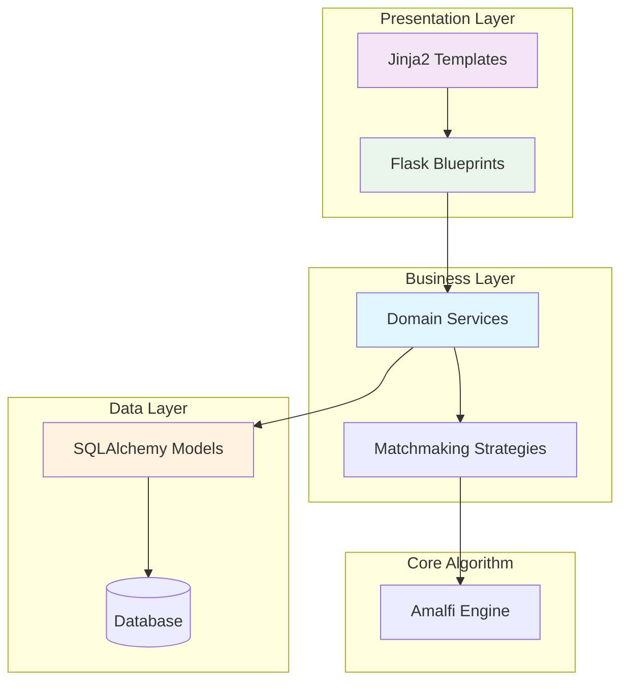

# Refactoring Status Assessment & Completion Plan

## Overview

This document assesses the current status of the comprehensive refactoring initiative for the tornei-biliardo webapp and provides a detailed plan to complete the remaining work. The refactoring aims to transform the monolithic architecture into a clean, maintainable, domain-driven design while preserving all functionality outlined in SPECIFICHE.md.

## Technology Stack

**Backend Framework**: Flask 2.3.3 with Blueprint-based architecture  
**Database**: SQLAlchemy 3.0.5 ORM with SQLite (dev) / PostgreSQL (prod)  
**Frontend**: Jinja2 templates with Bootstrap 5 and vanilla JavaScript  
**Testing**: Pytest with fixture-based testing  
**Dependencies**: Flask-Login 0.6.3, Werkzeug 2.3.7

## Architecture Overview

The system implements a Domain-Driven Design (DDD) pattern with layered architecture:



## Current Refactoring Status

### ✅ COMPLETED - Step 1: Route Blueprint Decomposition

**Achievement**: Successfully decomposed monolithic `routes/admin.py` (1,442 lines) into domain-specific blueprints.

**Domain Separation**:
- `routes/admin/tournament.py` - Tournament lifecycle management (204 lines)
- `routes/admin/competition.py` - Prova/competition management (605 lines)
- `routes/admin/match.py` - Match and rack operations (282 lines)
- `routes/admin/user.py` - User administration (158 lines)
- `routes/admin/dashboard.py` - Admin overview (16 lines)

**Quality Metrics**:
- **File Complexity**: Reduced largest file from 1,442 to 605 lines (58% improvement)
- **Domain Isolation**: Clear boundaries between business domains
- **URL Compatibility**: All existing endpoints preserved
- **Testing**: Smoke tests implemented for critical functionality

### 🔄 PARTIALLY COMPLETE - Step 2: Service Layer Implementation

**Current State**: Service layer exists but routes still contain direct database access patterns.

**Issues Identified**:
- Routes directly query models (`Tournament.query.get_or_404()`, `Prova.query.filter_by()`)
- Business logic scattered between routes and services
- Transaction management not consistently handled through services
- 25+ direct model query patterns found in admin routes

**Compliant Service Usage Examples Found**:
```python
# Good: Using service layer
prova_service = ProvaService()
matchmaking_service = get_matchmaking_service()
```

### ❌ INCOMPLETE - Step 3: Template Componentization

**Current State**: Large templates remain uncomponentized despite some component infrastructure.

**Critical Issues**:
- `admin/prova_detail.html` still 832 lines (target: <400 lines)
- `player/dashboard.html` and other large templates not componentized
- Component system exists but not systematically applied
- Business logic still embedded in templates

**Existing Components** (underutilized):
- `_admin_empty_state.html`
- `_prova_cards.html`
- `_resource_selector.html`
- `_tournament_cards.html`
- `_tournament_create_modal.html`

### ❌ INCOMPLETE - Step 4: Error Handling Unification

**Current State**: Not assessed in detail, likely still contains duplicate exception handling.

### ❌ INCOMPLETE - Step 5: Test Coverage Expansion

**Current State**: Minimal test coverage expansion beyond smoke tests.

**Test Files**:
- `test_user_crud.py` (14.2KB) - Original user testing
- `test_step1_admin_routes_smoke.py` (8.0KB) - Route decomposition validation
- `test_integration_phase3.py` (22.9KB) - Phase 3 integration tests
- `conftest.py` (5.3KB) - Test configuration

## SPECIFICHE.md Compliance Analysis

### Core Domain Requirements

**Tournament Management** (COMPLIANT):
- Tournament creation and lifecycle ✅
- Director assignment and co-director support ✅
- Soft delete with data preservation ✅

**Competition (Prova) Management** (COMPLIANT):
- Standalone and tournament-linked competitions ✅
- Amalfi algorithm integration ✅
- Inscription management with date controls ✅
- Minimum/maximum participant limits ✅

**Match Management** (COMPLIANT):
- Rack-by-rack result recording ✅
- Set-based match structure ✅
- Handicap system support ✅
- Individual match proposals ✅

**User Management** (COMPLIANT):
- Three-tier role system (guest/player/director) ✅
- Registration and soft delete ✅
- Privacy with encrypted personal data ✅

### Architectural Requirements from SPECIFICHE

**Privacy Compliance**: ✅ User data encryption implemented  
**Multi-Tournament Support**: ✅ Concurrent tournament management  
**Real-Time Classification**: ✅ Amalfi algorithm integration  
**Mobile-First UI**: ✅ Bootstrap 5 responsive design

## Remaining Work Assessment

### Priority 1: Complete Service Layer Implementation

**Objective**: Eliminate direct database access from routes and centralize business logic in domain services.

**Scope**:
- Refactor 25+ direct model queries in admin routes
- Implement transaction boundaries in service methods
- Extract complex business logic from route handlers
- Ensure all database operations go through service layer

**Impact**: Critical for maintainability and testability

### Priority 2: Template Componentization System

**Objective**: Break down large templates and create reusable component system.

**Scope**:
- Componentize `admin/prova_detail.html` (832 lines → <400 lines)
- Create macro system for common UI patterns
- Extract repeated template logic into reusable components
- Implement template composition patterns

**Impact**: High for maintainability and code reuse

### Priority 3: Test Coverage Expansion

**Objective**: Achieve comprehensive test coverage for refactored components.

**Scope**:
- Service layer unit tests
- Template rendering integration tests
- Business logic validation tests
- Edge case and error condition tests

**Impact**: High for regression prevention and development confidence

## Implementation Roadmap

### Phase 1: Service Layer Completion (Estimated: 5-7 days)

#### Step 1.1: Route-to-Service Migration
- Identify all direct model queries in `routes/admin/` files
- Create service methods for each database operation
- Implement proper transaction boundaries using `with db.session.begin()`
- Update routes to use service methods exclusively

#### Step 1.2: Business Logic Extraction
- Move complex logic from routes to appropriate domain services
- Implement validation logic in service layer
- Create consistent error handling patterns
- Ensure proper separation of concerns

#### Step 1.3: Transaction Management
- Implement explicit transaction boundaries in service methods
- Handle rollback scenarios properly
- Ensure ACID compliance for complex operations
- Create service base class for transaction management

### Phase 2: Template Componentization (Estimated: 3-4 days)

#### Step 2.1: Large Template Decomposition
- Break down `admin/prova_detail.html` into logical components
- Create reusable macros for common UI patterns
- Implement template composition for complex views
- Extract business logic from templates

#### Step 2.2: Component System Enhancement
- Expand existing component library
- Create standardized component patterns
- Implement consistent naming conventions
- Document component usage patterns

#### Step 2.3: Template Logic Cleanup
- Remove business logic calculations from templates
- Move complex display logic to context processors
- Implement proper separation between view and presentation logic
- Create template helper functions

### Phase 3: Test Coverage Enhancement (Estimated: 2-3 days)

#### Step 3.1: Service Layer Testing
- Create unit tests for all domain services
- Test transaction boundaries and error handling
- Validate business logic with edge cases
- Implement mock-based testing for external dependencies

#### Step 3.2: Integration Testing
- Create integration tests for complete user workflows
- Test template rendering with various data scenarios
- Validate Amalfi algorithm integration
- Test error scenarios and recovery

#### Step 3.3: Regression Testing
- Create comprehensive smoke tests for all major functionality
- Implement automated testing for SPECIFICHE.md compliance
- Create performance regression tests
- Document testing procedures

## Quality Gates

### Service Layer Quality Gates
- [ ] Zero direct `db.session` usage in route files
- [ ] All database operations through service methods
- [ ] Proper transaction boundary management
- [ ] Business logic extracted from routes
- [ ] Consistent error handling patterns

### Template Quality Gates
- [ ] No template files >400 lines
- [ ] Reusable component system implemented
- [ ] Business logic removed from templates
- [ ] Consistent UI patterns across views
- [ ] Mobile-responsive design preserved

### Testing Quality Gates
- [ ] ≥90% test coverage on service methods
- [ ] Integration tests for critical user workflows
- [ ] Performance tests for Amalfi algorithm
- [ ] Regression tests for existing functionality
- [ ] Documentation for testing procedures

## Risk Assessment

### High-Risk Areas

**Service Layer Migration**:
- Risk: Breaking existing functionality during extraction
- Mitigation: Incremental migration with comprehensive testing

**Template Refactoring**:
- Risk: UI inconsistencies or broken layouts
- Mitigation: Component-by-component approach with visual testing

**Transaction Management**:
- Risk: Data inconsistency or deadlock scenarios
- Mitigation: Thorough testing of complex business operations

### Compatibility Risks

**URL Preservation**: Low risk - blueprint decomposition already handled this  
**Data Integrity**: Medium risk - requires careful transaction management  
**Performance**: Low risk - service layer should improve performance through better caching

## Success Metrics

### Quantitative Metrics
- **File Complexity**: No files >400 lines (excluding legacy)
- **Database Access**: Zero direct queries in route files
- **Test Coverage**: ≥90% on refactored components
- **Template Size**: Largest template <400 lines
- **Component Reuse**: ≥5 reusable template components

### Qualitative Metrics
- **Maintainability**: Domain-specific changes isolated to single modules
- **Testability**: Business logic testable in isolation
- **Code Quality**: Consistent patterns across domains
- **Documentation**: Clear architectural decisions recorded

## Next Steps

### Immediate Actions (Next 1-2 days)
1. **Service Layer Audit**: Complete detailed analysis of remaining direct database access
2. **Create Service Migration Plan**: Prioritize routes by complexity and risk
3. **Template Analysis**: Catalog large templates and componentization opportunities
4. **Test Infrastructure**: Enhance test fixtures for comprehensive coverage

### Short-term Goals (Next 2 weeks)
1. **Complete Service Layer**: Eliminate all direct database access from routes
2. **Componentize Critical Templates**: Focus on `admin/prova_detail.html` and other >400 line templates
3. **Expand Test Coverage**: Achieve ≥90% coverage on refactored service layer
4. **Documentation Update**: Update architectural documentation to reflect new patterns

### Long-term Benefits
- **Team Productivity**: Parallel development on different domains without conflicts
- **Bug Reduction**: Clear separation of concerns reduces complexity-related errors
- **Feature Development**: Clean architecture enables faster feature implementation
- **Maintenance**: Isolated domains make debugging and updates more efficient

The refactoring initiative is approximately 60% complete with the foundation (route decomposition) successfully established. The remaining work focuses on completing the service layer implementation and template componentization to achieve the full benefits of the domain-driven architecture.