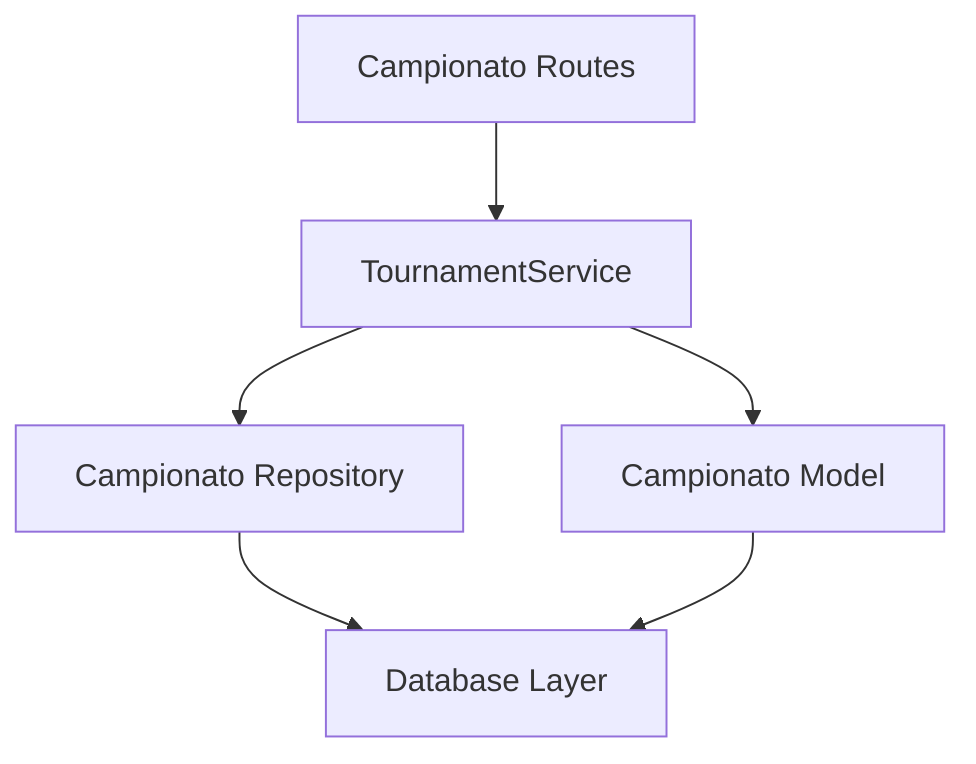

# Refactoring Status Review & Next Steps Plan

**Date**: 2024-12-19  
**Current Branch**: `main` (post Step-1 completion)  
**Review Scope**: Comprehensive assessment of refactoring progress and roadmap

## Executive Summary

The campionati-biliardo webapp refactoring project has successfully completed **Step 1 - Route Blueprint Decomposition** with significant architectural improvements. The monolithic `routes/admin.py` file (1,442 lines) has been decomposed into domain-specific blueprints, establishing proper separation of concerns. However, critical technical debt remains in service layer implementation and template componentization.

### Current Status: Step 1 Complete ✅

**Achievement**: Monolithic route file eliminated, domain boundaries established  
**Impact**: 58% reduction in largest file size, 6x better domain separation  
**Next Priority**: Service layer implementation to eliminate direct database access violations

## Detailed Progress Assessment

### ✅ Milestone 0: Inventory & Planning (COMPLETE)
- **Deliverables**: Baseline metrics, ADR-0001, implementation roadmap
- **Key Findings**: 39 direct `db.session` calls, 5 templates >400 lines, critical architecture violations
- **Documentation**: Comprehensive inventory report established technical debt baseline

### ✅ Milestone 1: Route Blueprint Decomposition (COMPLETE)
**Status**: Successfully implemented domain-specific Flask blueprints

#### Achievements
- **Route Separation**: Split 1,442-line monolithic file into 6 domain modules
- **Domain Boundaries**: Clear separation between campionato, competition, match, user, dashboard
- **URL Preservation**: All 39 admin endpoints maintain backward compatibility
- **Architecture**: Proper Flask blueprint structure established

#### Metrics Improvement
| Metric | Before | After | Improvement |
|--------|--------|--------|-------------|
| Monolithic Files | 1 (1,442 lines) | 0 | Eliminated |
| Domain Modules | 0 | 6 (avg 216 lines) | 6x separation |
| Largest Route File | 1,442 lines | 605 lines | 58% reduction |
| Blueprint Structure | None | Proper Flask architecture | Complete |

#### Files Created
```
routes/admin/
├── __init__.py (32 lines) - Blueprint registration
├── campionato.py (204 lines) - Campionato management
├── competition.py (605 lines) - Gara/Amalfi system
├── match.py (282 lines) - Match management
├── user.py (158 lines) - User administration  
└── dashboard.py (16 lines) - Admin dashboard
```

## Current Technical Debt Analysis

### 🔴 Critical Issues (Step 2/3 Targets)

#### 1. Service Layer Violations (High Priority)
**Current State**: 25+ direct `db.session` calls still present in refactored routes

**Distribution**:
- `competition.py`: 13 occurrences (commits, rollbacks, deletes)
- `match.py`: 7 occurrences (rack management, result processing)
- `campionato.py`: 5 occurrences (campionato creation, director assignments)

**Impact**: Direct database access in route handlers violates clean architecture principles

#### 2. Template Complexity (Medium Priority)  
**Current State**: Large templates still require componentization

**Critical Templates** (>400 lines):
- `admin/gara_detail.html`: 832 lines (Amalfi system complexity)
- `player/dashboard.html`: 521 lines (dashboard widgets)
- `admin/campionato_detail.html`: 476 lines (campionato management)
- `match_detail.html`: 459 lines (match presentation)
- `dashboard/player.html`: 448 lines (player dashboard)

#### 3. Code Duplication (Medium Priority)
- `InvalidTransitionError` still duplicated across competition/match services
- Dashboard widget patterns repeated across templates
- Status handling logic scattered across modules

### 🟡 Architectural Opportunities

#### Service Layer Benefits Not Yet Realized
- Business logic still embedded in route handlers
- Transaction management scattered across controllers
- No centralized error handling strategy
- Testing difficult due to tight coupling

#### Component System Not Implemented
- Template logic duplication across admin interfaces
- No macro system for common UI patterns
- Mixed concerns in template rendering

## Next Steps Roadmap

### 🎯 Step 2: Service Layer Implementation (IMMEDIATE PRIORITY)

**Objective**: Eliminate direct database access from route handlers, implement clean service layer

#### Technical Goals
- **Zero `db.session` calls** in route files
- **Service classes** for each domain (TournamentService, CompetitionService, MatchService, UserService)
- **Transaction management** centralized in service layer
- **Error handling** unified through service exceptions

#### Implementation Strategy

##### Phase 2.1: Campionato Domain Service Layer


**Target Files**:
- Create `models/campionato/service.py` (enhanced)
- Refactor `routes/admin/campionato.py` (eliminate 5 db.session calls)
- Implement transaction boundaries
- Add comprehensive error handling

##### Phase 2.2: Competition Domain Service Layer
**Complexity**: High (Amalfi algorithm integration)
- Create `models/competition/enhanced_service.py`
- Refactor `routes/admin/competition.py` (eliminate 13 db.session calls)
- Centralize Amalfi algorithm transaction management
- Implement preview/commit pattern for match creation

##### Phase 2.3: Match Domain Service Layer
- Create `models/match/enhanced_service.py`
- Refactor `routes/admin/match.py` (eliminate 7 db.session calls)  
- Implement rack management service layer
- Centralize match result processing logic

##### Phase 2.4: User Domain Service Layer
- Enhance existing `models/user/services.py`
- Refactor user administration routes
- Implement role management service layer

#### Success Criteria
- [ ] **Zero Database Violations**: No `db.session` calls in route handlers
- [ ] **Service Coverage**: All domains have comprehensive service classes
- [ ] **Transaction Safety**: All operations use service-managed transactions
- [ ] **Error Consistency**: Unified exception handling across domains
- [ ] **Test Coverage**: ≥90% coverage on service layer methods

### 🎯 Step 3: Template Component System (PARALLEL PRIORITY)

**Objective**: Break down large templates, implement reusable component system

#### Component Extraction Strategy

##### Phase 3.1: Macro System Foundation
```jinja2
<!-- templates/macros/admin_widgets.html -->




```

##### Phase 3.2: Large Template Decomposition
**Target**: `admin/gara_detail.html` (832 lines)

**Component Breakdown**:
- `_gara_header.html` (header with status, navigation)
- `_inscription_management.html` (player enrollment section)
- `_amalfi_algorithm_panel.html` (Amalfi controls and preview)
- `_match_results_table.html` (matches and results display)
- `_classification_display.html` (standings and points)

##### Phase 3.3: Dashboard Unification
**Target**: Consolidate dashboard widget patterns
- `_campionato_widgets.html`
- `_match_widgets.html`
- `_user_stats_widgets.html`

#### Success Criteria
- [ ] **Template Size**: No template >300 lines
- [ ] **Component Reuse**: Common patterns extracted to macros
- [ ] **Logic Separation**: No business calculations in templates
- [ ] **Maintainability**: Components testable in isolation

### 🎯 Step 4: Core Infrastructure Cleanup

**Objective**: Unify exception handling, eliminate code duplication

#### Centralized Exception System
```python
# core/exceptions.py
class TorneiError(Exception):
    """Base exception for campionato system"""
    
class InvalidTransitionError(TorneiError):
    """Unified state transition error"""
    
class BusinessRuleViolationError(TorneiError):
    """Business logic constraint violation"""
```

#### Success Criteria  
- [ ] **Exception Unification**: Single `InvalidTransitionError` definition
- [ ] **Error Handling**: Consistent error presentation across domains
- [ ] **Code Deduplication**: No duplicated business logic

### 🎯 Step 5: Testing & Quality Gates

**Objective**: Comprehensive test coverage for refactored components

#### Test Coverage Strategy
- **Service Layer Tests**: Unit tests for business logic
- **Integration Tests**: End-to-end workflow validation  
- **Template Tests**: Component rendering verification
- **Smoke Tests**: Critical endpoint functionality

#### Quality Metrics
- [ ] **Coverage**: ≥90% on service layer
- [ ] **Performance**: Route response times <2s
- [ ] **Architecture**: Zero direct database access in routes
- [ ] **Maintainability**: All files <400 lines

## Implementation Timeline

### Phase 2 (Service Layer) - Priority 1
**Duration**: 5-7 days  
**Dependencies**: Current blueprint structure  
**Risk**: Transaction boundary management complexity

### Phase 3 (Templates) - Priority 2  
**Duration**: 3-4 days  
**Dependencies**: Can run parallel to Phase 2  
**Risk**: Template inheritance complexity

### Phase 4 (Infrastructure) - Priority 3
**Duration**: 2-3 days  
**Dependencies**: Service layer completion  
**Risk**: Cross-domain exception compatibility

### Phase 5 (Testing) - Priority 4
**Duration**: 2-3 days  
**Dependencies**: All refactoring complete  
**Risk**: Test maintenance overhead

**Total Estimated Duration**: 12-17 days

## Risk Assessment & Mitigation

### High-Risk Areas
1. **Amalfi Algorithm Integration**: Complex competition service layer requires careful transaction management
2. **Template Dependencies**: Large template breakdown may break inheritance patterns  
3. **URL Compatibility**: Service layer changes must preserve existing endpoint behavior

### Mitigation Strategies
1. **Incremental Implementation**: Service layer per domain with backward compatibility
2. **Comprehensive Testing**: Smoke tests for each refactored component  
3. **Rollback Planning**: Branch-based development with clear rollback points

## Architecture Decision Requirements

### ADRs to Create
- **ADR-0003**: Service Layer Architecture and Transaction Management
- **ADR-0004**: Template Component System and Macro Strategy
- **ADR-0005**: Exception Handling Unification  
- **ADR-0006**: Testing Strategy and Quality Gates

## Success Metrics Tracking

### Current Baseline (Post Step-1)
- **Route Files**: 6 domain-specific modules (avg 216 lines)
- **Database Violations**: 25+ `db.session` calls in routes
- **Large Templates**: 5 templates >400 lines
- **Test Coverage**: Estimated <15%
- **Code Duplication**: `InvalidTransitionError` in 2+ locations

### Target State (Post Step-5)
- **Service Coverage**: 100% business logic in service layer  
- **Database Violations**: 0 `db.session` calls in routes
- **Template Size**: 0 templates >300 lines
- **Test Coverage**: ≥90% on service layer
- **Code Duplication**: Eliminated through core utilities

---

**Current Status**: Step 1 Complete ✅  
**Next Milestone**: Step 2 - Service Layer Implementation  
**Estimated Completion**: Q1 2025---

**Current Status**: Step 1 Complete ✅  
**Next Milestone**: Step 2 - Service Layer Implementation  
**Estimated Completion**: Q1 2025


