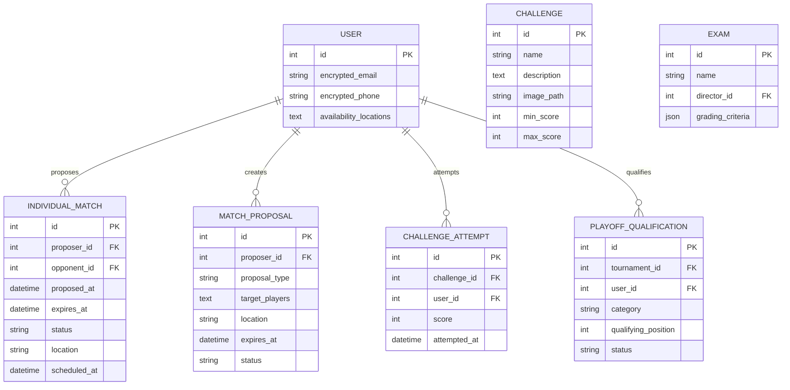

# Repository Consistency Analysis - Tornei Biliardo

## Overview

This document analyzes the current tornei-biliardo repository structure against the provided specifications (SPECIFICHE.md) to identify inconsistencies, missing features, and required architectural changes to align the codebase with the specified requirements.

## Technology Stack Analysis

**Current Implementation:**
- Backend: Flask 2.3.3 with SQLAlchemy ORM
- Frontend: Server-side rendering with Jinja2 templates, Bootstrap 5
- Database: SQLite (development), PostgreSQL (production)
- Authentication: Flask-Login with role-based access control
- Architecture: Domain-driven design with modular structure

**Specification Alignment:** ✅ Compliant - The current technology stack aligns well with the specifications.

## User Management Domain Analysis

### Current Implementation Status

```mermaid
classDiagram
    class User {
        +int id
        +string username
        +string email
        +string role
        +bool soft_deleted
        +datetime deleted_at
        +is_admin()
        +is_director()
        +is_player()
        +can_manage_tournament()
    }
    
    class TournamentDirector {
        +int tournament_id
        +int user_id
    }
    
    class DirectorRequest {
        +int id
        +int user_id
        +string status
        +datetime created_at
    }
    
    User ||--o{ TournamentDirector : manages
    User ||--o{ DirectorRequest : requests
```

**Specification Compliance:**
- ✅ Three user types: guest, player, director
- ✅ Admin user configuration via server settings
- ✅ Director request system
- ✅ Soft delete functionality with pseudonymization
- ⚠️ **Missing**: User privacy encryption (specifications require encrypted personal data)

### Missing Features

1. **Data Encryption**: Personal information should be encrypted with server-side key
2. **Player Availability System**: Missing location-based availability for individual matches
3. **Friends/Previous Players System**: No relationship tracking for match proposals

## Tournament Management Domain Analysis

### Current Implementation Status

```mermaid
classDiagram
    class Tournament {
        +int id
        +string name
        +string tournament_type
        +bool without_x
        +bool final_playoffs
        +bool challenge_mode
        +bool is_active
        +get_status()
        +can_be_modified()
        +can_be_deleted()
    }
    
    class Prova {
        +int id
        +int tournament_id
        +int director_id
        +int number
        +string name
        +date date
        +string location
        +int rounds_count
        +string discipline
        +int distance
        +bool best_of
        +is_standalone
        +get_organizer()
    }
    
    Tournament ||--o{ Prova : contains
```

**Specification Compliance:**
- ✅ Tournament creation by admin/director
- ✅ Multiple competition rounds (prove) per tournament
- ✅ Standalone competitions support
- ✅ Tournament type configuration (Amalfi)
- ✅ Playoff configuration flag
- ⚠️ **Partially Implemented**: Challenge mode exists as flag but not functional
- ❌ **Missing**: Actual playoff functionality implementation

### Missing Features

1. **Playoff Implementation**: Currently only a boolean flag, needs full playoff logic
2. **Challenge Integration**: Challenge mode exists but lacks implementation
3. **Tournament Soft Delete**: Specification requires soft delete for tournaments with played matches

## Competition Management Analysis

### Current Implementation Status

**Specification Compliance:**
- ✅ Competition rounds (prove) within tournaments
- ✅ Standalone competitions
- ✅ Player inscription/withdrawal system
- ✅ Minimum/maximum participants
- ✅ Entry fees
- ✅ Multiple pairing strategies (Amalfi implemented)
- ✅ Forfeit policies (exclude/forfeit)
- ❌ **Missing**: Challenge integration within competitions

### Pairing Strategy Analysis

**Currently Implemented:**
- ✅ Amalfi strategy with anti-rematch logic
- ✅ First round random pairing
- ✅ Trio match handling for odd players
- ✅ Bye ("X") handling

**Missing Strategies:**
- ❌ Round Robin pairing
- ❌ Direct elimination pairing
- ❌ Double knockout pairing
- ❌ Classification-based first pairing
- ❌ Rating-based first pairing (Fargo/Elo)

## Match Management Domain Analysis

### Current Implementation Status

```mermaid
classDiagram
    class Match {
        +int id
        +int prova_id
        +int round_number
        +int player1_id
        +int player2_id
        +bool is_bye
        +int player1_score
        +int player2_score
        +int winner_id
        +string status
        +bool is_trio
    }
    
    class Rack {
        +int id
        +int match_id
        +int rack_number
        +int winner_id
        +bool confirmed_by_player
        +bool validated_by_admin
    }
    
    class TrioMatch {
        +int id
        +int match_id
        +int player1_id
        +int player2_id
        +int player3_id
        +int player1_racks
        +int player2_racks
        +int player3_racks
        +bool is_completed
        +add_rack_win()
        +get_current_state()
    }
    
    Match ||--o{ Rack : contains
    Match ||--o| TrioMatch : extends
```

**Specification Compliance:**
- ✅ Match with multiple racks/sets
- ✅ Break rules configuration
- ✅ Distance configuration (best of vs exact)
- ✅ Trio match support
- ❌ **Missing**: Multiple set support (currently only single set matches)
- ❌ **Missing**: Handicap system based on categories/ratings
- ❌ **Missing**: Multiple discipline support within same match
- ❌ **Missing**: Individual match proposals between players

### Critical Missing Features

1. **Individual Match System**: Complete player-to-player match proposal system
2. **Match Invitation System**: Targeted and open proposals with notifications
3. **Handicap System**: Category and rating-based handicaps
4. **Multiple Set Matches**: Currently only single set supported
5. **Multi-Discipline Matches**: Same match with different disciplines per rack

## Challenge and Examination System Analysis

### Current Implementation Status

**Status:** ❌ **COMPLETELY MISSING**

The specifications define a comprehensive challenge and examination system that is completely absent from the current implementation:

### Missing Challenge Features

1. **Challenge Model**: Skill challenges with image and description
2. **Challenge Results**: Individual player attempts and scoring
3. **Challenge Categories**: Personal favorites, general catalog
4. **Challenge Statistics**: Admin statistics view
5. **Challenge Integration**: Usage in competitions for "X" replacement

### Missing Examination Features

1. **Exam Model**: Multiple challenge collections with grading
2. **Exam Creation**: Director/admin exam creation
3. **Exam Statistics**: Performance tracking and reporting
4. **Grading System**: Score-to-level mapping

```mermaid
classDiagram
    class Challenge {
        +int id
        +string name
        +string description
        +string image_path
        +int min_score
        +int max_score
        +bool pass_fail_only
        +get_statistics()
    }
    
    class ChallengeAttempt {
        +int id
        +int challenge_id
        +int user_id
        +int score
        +bool passed
        +datetime attempted_at
    }
    
    class ChallengeFavorite {
        +int id
        +int challenge_id
        +int user_id
    }
    
    class Exam {
        +int id
        +string name
        +int director_id
        +string grading_criteria
        +datetime created_at
    }
    
    class ExamChallenge {
        +int id
        +int exam_id
        +int challenge_id
        +int order
    }
    
    class ExamAttempt {
        +int id
        +int exam_id
        +int user_id
        +string final_grade
        +datetime completed_at
    }
    
    Challenge ||--o{ ChallengeAttempt : attempted_by
    Challenge ||--o{ ChallengeFavorite : favorited_by
    Challenge ||--o{ ExamChallenge : part_of
    Exam ||--o{ ExamChallenge : contains
    Exam ||--o{ ExamAttempt : attempted_by
```

## Classification System Analysis

### Current Implementation Status

**Specification Compliance:**
- ✅ Round classifications
- ✅ Tournament overall classifications
- ✅ Multi-criteria sorting (wins, rack difference, position)
- ✅ Real-time classification updates
- ❌ **Missing**: Tiebreaker system implementation
- ❌ **Missing**: Playoff qualification based on classification

### Missing Classification Features

1. **Tiebreaker System**: Spot shot rallies and playoff matches for ties
2. **Playoff Qualification**: Automatic playoff invitations based on ranking
3. **Challenge-Based Scoring**: Classification integration with challenge results

## Dashboard and User Experience Analysis

### Current Implementation Status

**Specification Compliance:**
- ✅ Admin dashboard with tournament management
- ✅ Director dashboard with limited tournament management
- ✅ Player dashboard with tournaments and standings
- ❌ **Missing**: Individual match proposal interface
- ❌ **Missing**: Match opportunity notifications
- ❌ **Missing**: Location-based match suggestions

### Missing Dashboard Features

1. **Match Proposal Interface**: Create and manage individual match proposals
2. **Notification System**: Real-time notifications for proposals and invitations
3. **Location Management**: Player availability by billiard hall
4. **Match Opportunity Feed**: Open match proposals display

## Architecture Gaps and Technical Requirements

### Database Schema Extensions Required



### Service Layer Extensions Required

1. **Individual Match Service**: Match proposal lifecycle management
2. **Challenge Service**: Challenge and exam management
3. **Notification Service**: Real-time user notifications
4. **Location Service**: Billiard hall and availability management
5. **Playoff Service**: Tournament playoff orchestration

### Frontend Extensions Required

1. **Challenge Interface**: Challenge catalog and attempt tracking
2. **Match Proposal Interface**: Individual match creation and management
3. **Notification System**: Real-time alerts and updates
4. **Player Profile Extensions**: Availability and statistics

## Security and Privacy Compliance

### Current Implementation Gaps

1. **Data Encryption**: Personal data not encrypted as specified
2. **Privacy Configuration**: Missing server-side encryption key management
3. **Audit Trail**: Limited audit trail for sensitive operations

### Required Security Enhancements

1. **Field-Level Encryption**: Encrypt email, phone, and personal data
2. **Key Management**: Secure server-side key storage and rotation
3. **Privacy Controls**: Enhanced user data management and export

## Implementation Priority Matrix

### High Priority (Core Specification Compliance)

| Feature | Impact | Effort | Priority |
|---------|--------|--------|----------|
| Individual Match System | High | High | 1 |
| Challenge System | High | Medium | 2 |
| Data Encryption | High | Medium | 3 |
| Playoff Implementation | Medium | High | 4 |

### Medium Priority (Enhanced Functionality)

| Feature | Impact | Effort | Priority |
|---------|--------|--------|----------|
| Additional Pairing Strategies | Medium | Medium | 5 |
| Examination System | Medium | Medium | 6 |
| Handicap System | Medium | Medium | 7 |
| Notification System | Medium | Low | 8 |

### Low Priority (Quality of Life)

| Feature | Impact | Effort | Priority |
|---------|--------|--------|----------|
| Multi-Set Matches | Low | Medium | 9 |
| Multi-Discipline Matches | Low | High | 10 |
| Advanced Tiebreakers | Low | Medium | 11 |

## Architectural Recommendations

### 1. Domain Extension Strategy

Extend the current domain-driven architecture with new domains:
- **Individual Match Domain**: `models/individual_match/`
- **Challenge Domain**: `models/challenge/`
- **Notification Domain**: `models/notification/`
- **Location Domain**: `models/location/`

### 2. Service Layer Enhancement

Implement new service layers following existing patterns:
- **IndividualMatchService**: Match proposal lifecycle
- **ChallengeService**: Challenge and exam management
- **NotificationService**: Real-time notifications
- **PlayoffService**: Tournament playoff management

### 3. Database Migration Strategy

Implement incremental migrations to:
1. Add encryption to existing personal data fields
2. Create new tables for missing features
3. Extend existing tables with new relationships
4. Maintain backward compatibility during transition

### 4. API Extension Strategy

Extend the current route structure:
- **Individual Match Routes**: `/player/matches/`
- **Challenge Routes**: `/challenges/`
- **Notification Routes**: `/api/notifications/`
- **Admin Extensions**: Enhanced admin interfaces

## Testing Strategy for New Features

### Unit Testing Requirements

1. **Service Layer Tests**: Each new service requires comprehensive unit tests
2. **Model Tests**: Validation, relationships, and business logic
3. **Integration Tests**: Cross-domain functionality
4. **Security Tests**: Encryption and privacy compliance

### Test Coverage Goals

- **Individual Match System**: >90% coverage
- **Challenge System**: >85% coverage
- **Data Encryption**: 100% coverage
- **Playoff System**: >85% coverage

## Migration and Deployment Considerations

### Database Migration Strategy

1. **Phase 1**: Add new tables without breaking existing functionality
2. **Phase 2**: Migrate existing data to encrypted format
3. **Phase 3**: Deploy new features incrementally
4. **Phase 4**: Remove deprecated code and optimize

### Backward Compatibility

Maintain backward compatibility for:
- Existing tournament and match data
- Current user authentication flows
- Admin and director interfaces
- Player statistics and history

## Conclusion

The tornei-biliardo repository demonstrates a solid foundation with good architectural principles, but requires significant extensions to fully comply with the specifications. The most critical gaps are:

1. **Individual Match System** - Completely missing but essential for community features
2. **Challenge and Examination System** - Absent but specified as core functionality  
3. **Data Privacy Compliance** - Required encryption not implemented
4. **Playoff System** - Partially implemented, needs completion

The existing domain-driven architecture provides an excellent foundation for these extensions, and the modular structure will facilitate incremental implementation while maintaining system stability.