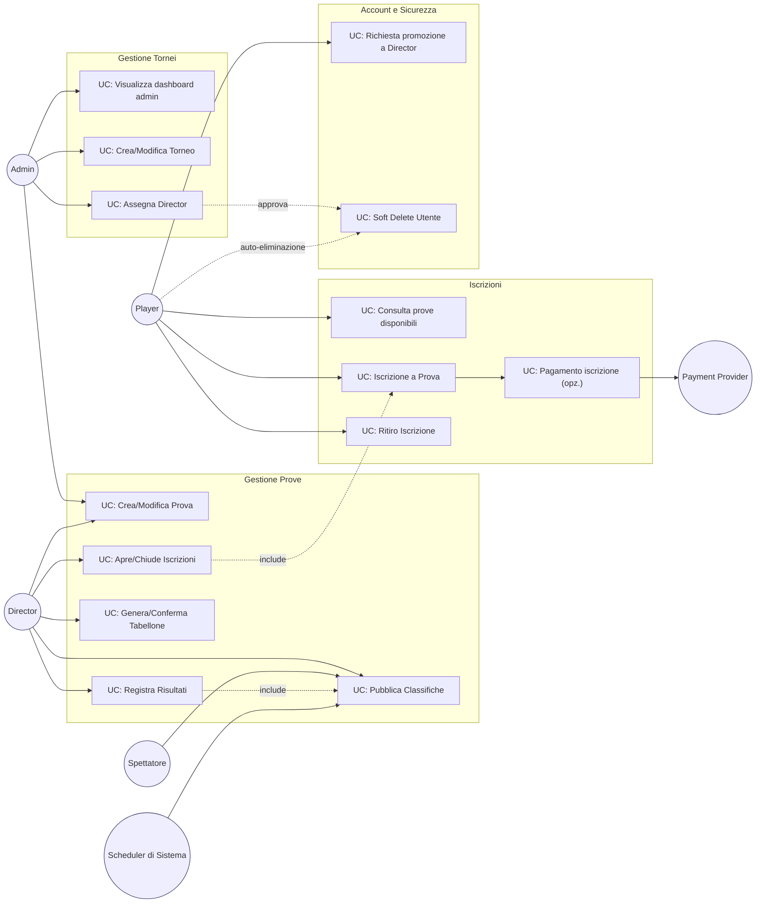
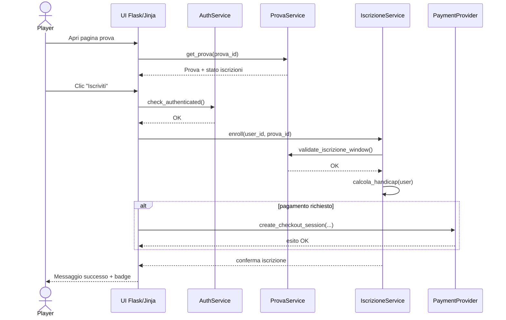
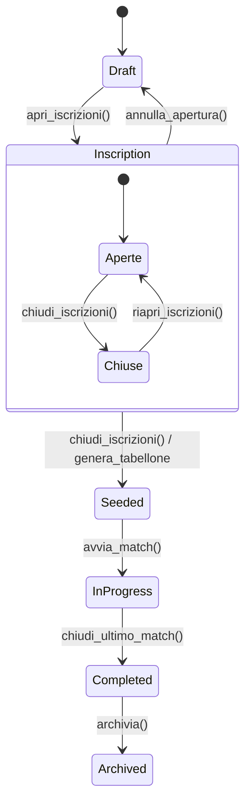
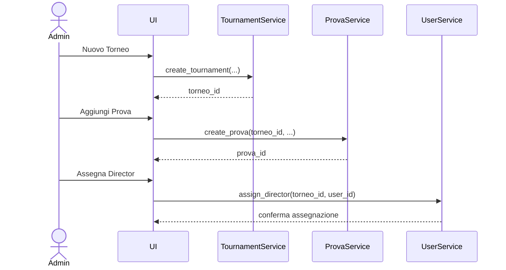
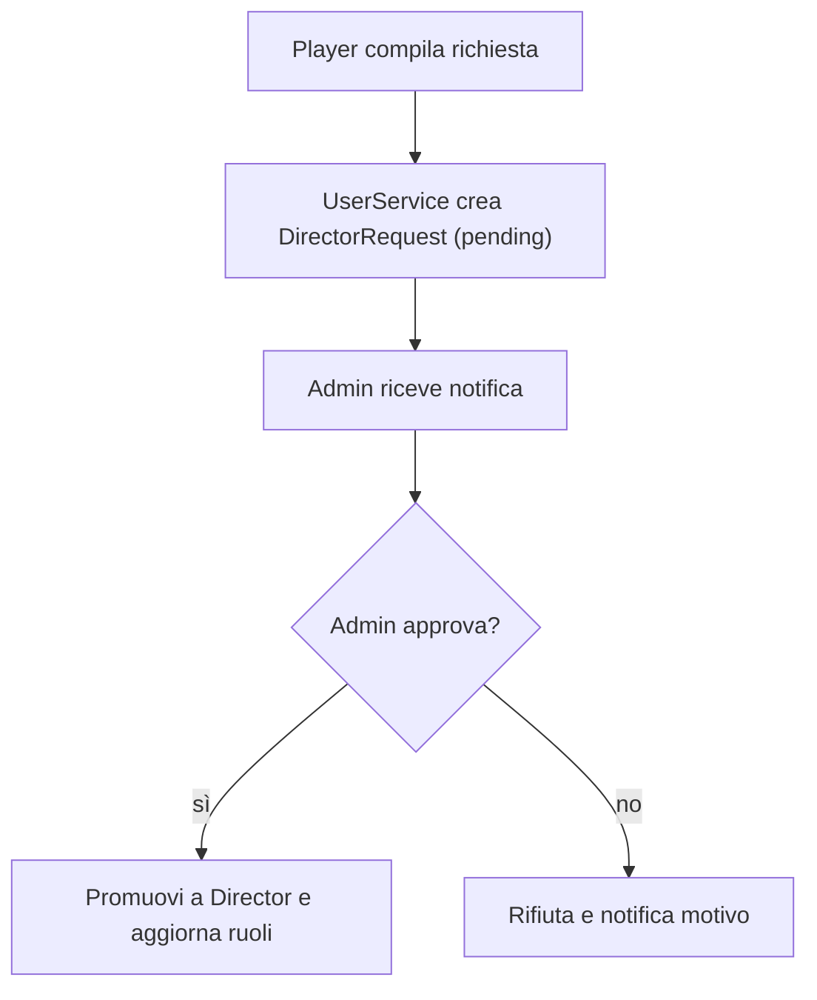
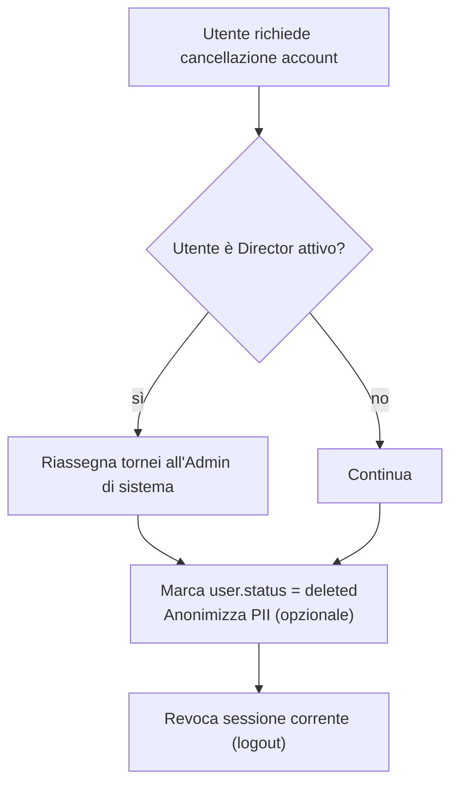
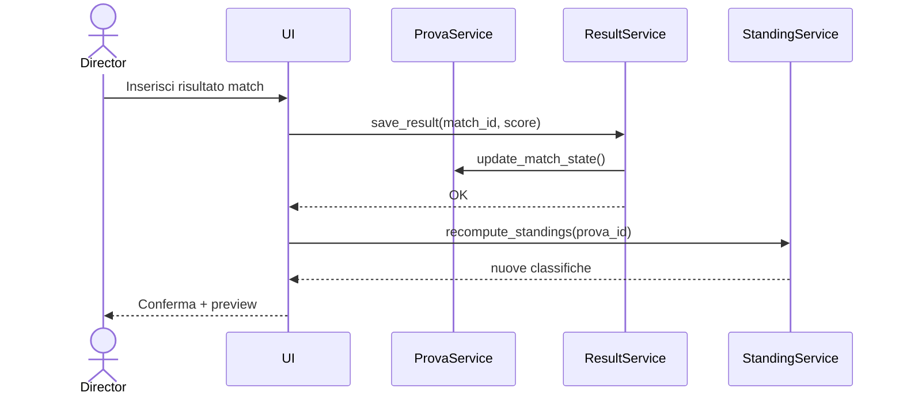

# Casi d’uso principali — Webapp Tornei di Biliardo (Mermaid)

Documento in **Markdown** con diagrammi in **Mermaid** per la webapp di gestione tornei e prove di biliardo professionale.

> Nota: i nomi dei servizi (es. `ProvaService`, `StandingService`) rappresentano l’Application Layer in ottica Clean Architecture; gli accessi a DB sono incapsulati in repository.

---

## 1) Overview attori e macro‑casi d’uso

---

## 2) UC‑01 — Iscrizione del Player a una Prova

### Sequenza

**Pre‑condizioni**

* Prova in stato **Iscrizioni Aperte**.
* Utente autenticato e con requisiti (ranking/limiti di partecipazione) validi.

**Post‑condizioni**

* Record di iscrizione creato; eventuale transazione registrata.

---

## 3) UC‑02 — Gestione stato di una Prova (Director)

### Macchina a stati

**Regole di transizione (estratto)**

* `apri_iscrizioni()` vietato se esistono match già sorteggiati.
* `riapri_iscrizioni()` consentito solo se non sono iniziati i match.

---

## 4) UC‑03 — Admin crea Torneo/Prova e assegna Director

### Sequenza (riassunta)

---

## 5) UC‑04 — Richiesta promozione a Director (Player → Admin)

### Attività

---

## 6) UC‑05 — Soft Delete Utente con riassegnazione

### Attività

---

## 7) UC‑06 — Inserimento risultati e pubblicazione classifiche (live)

### Sequenza

---

## Glossario minimo

* **Torneo**: contenitore di più *Prove*.
* **Prova**: singolo evento/competizione; ha stati (draft, iscrizioni, in corso, completata...).
* **Iscrizione**: relazione Player–Prova con eventuale pagamento.
* **Director**: responsabile operativo di Tornei/Prove.
* **Admin**: superutente con poteri su tutto il dominio.

> Questi diagrammi sono base per ADR e test di integrazione; vanno sincronizzati con i Blueprint Flask (`admin`, `director`, `player`) e con i servizi applicativi.
