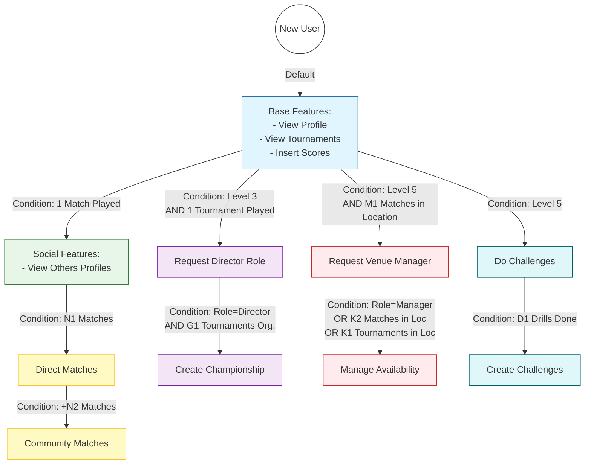
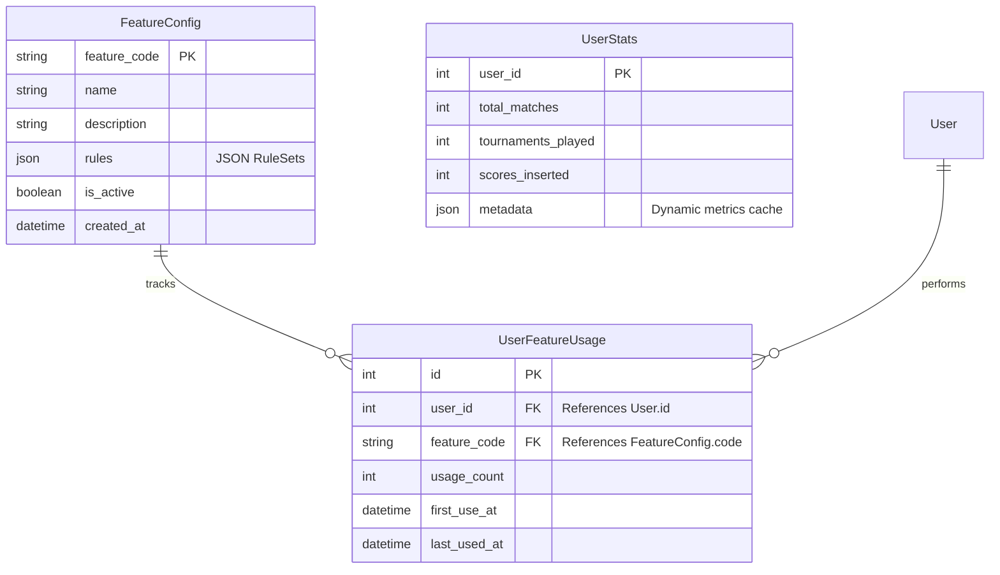

# ADR-020: Comprehensive Gamification System v2 (ABAC)

**Date**: 2026-01-25
**Status**: Accepted / Production Standard
**Decisora**: Antigravity, User

## 1. Overview & Vision
The Gamification V2 system represents a fundamental shift from a rigid, level-only progression model to a dynamic, **Attribute-Based Access Control (ABAC)** logic. 

### Core Philosophy: "Polite & Ubiquitous"
Instead of overwhelming the user with persistent widgets and intrusive popups, we adopted a "polite" approach:
- **Subtle Cues**: A persistent navbar badge showing Level/XP.
- **Transient Signals**: Animated Toasts starring the **Chalky** mascot for real-time feedback.
- **Contextual Discovery**: Using **Nudges** to suggest relevant features only when they are unlocked but remain unused.

---

## 2. Logic Architecture: The "Gatekeeper" Engine
The system uses a hierarchical rule evaluation engine to determine feature accessibility.

### Rule Hierarchy & Logic
A Feature is granted if **ANY** of its `RuleSets` (OR logic) is valid.
A `RuleSet` is valid if **ALL** of its `Conditions` (AND logic) are satisfied.

- **Feature**: `create_match_community`
- **RuleSet A**: (Level >= 50)
- **RuleSet B**: (TotalMatches >= 15 AND ScoresInserted >= 3)
- **Result**: User with Level 50 OR User with 15 matches/3 scores both get access.

### Supported Condition Types (Extensible)
| Condition Type | Data Source | Logic Example |
| :--- | :--- | :--- |
| **LEVEL** | `User.level` | `user.level >= 10` |
| **METRIC** | `MetricService` | `user.total_matches >= 20` |
| **ROLE** | `User.roles` | `user.has_role('DIRECTOR')` |
| **ACHIEVEMENT** | `UserAchievement` | `user.has_achievement('rookie_season')` |
| **LOCATION** | `VenueStats` | `matches_in_location('CentralClub') >= 50` |

---

## 3. Detailed Feature Specifications (20 Features)

### Legend: System Constants
These constants define the numerical thresholds used across various rules:
- **N1**: General experience threshold (Default: 5 matches)
- **N2**: Community trust threshold (+10 matches, Total: 15)
- **M1**: Venue pillar status (Default: 50 matches in one location)
- **K1**: Venue veteran status (Default: 5 tournaments in one location)
- **K2**: Venue regular status (Default: 20 matches in one location)
- **G1**: Experienced organizer (Default: 3 tournaments organized)
- **D1**: Skill challenge mastery (Default: 5 challenges completed)

### Full Feature Inventory

#### Group 1: Core, Social & Stats
| Feature Name | Code | Default Unlock Logic | Related Badge |
| :--- | :--- | :--- | :--- |
| **View Others Profiles** | `view_other_profiles` | `total_matches >= 1` | "First Contact" |
| **Global Statistics** | `view_global_stats` | `level >= 1` (Always Available) | - |
| **Proposte Partita** | `match_proposals` | `level >= 5` (Legacy Level Lock) | "Level 5" |
| **Inviti Prioritari** | `priority_invites` | `level >= 15` (Legacy Level Lock) | "Level 15" |
| **Bacheca Badges** | `custom_badge_display` | `level >= 20` (Legacy Level Lock) | "Level 20" |
| **Status Leggenda** | `legend_status` | `level >= 50` (Legacy Level Lock) | "Level 50" |

#### Group 2: Matchmaking & Social Play
| Feature Name | Code | Default Unlock Logic | Related Badge |
| :--- | :--- | :--- | :--- |
| **Create Direct Match** | `create_match_direct` | `total_matches >= 5` (N1) AND `scores_inserted >= 1` | "Rookie", "Scorer" |
| **Create Community Match** | `create_match_community` | `total_matches >= 15` (N1 + N2) | "Regular" |
| **Manage Availability** | `manage_availability` | **OR**: 1. `role == VENUE_MANAGER`, 2. `matches_in_location >= 20` (K2), 3. `tournaments_in_location >= 5` (K1) | "Local Hero" |
| **Participate in Challenges** | `do_challenge` | **OR**: 1. `level >= 5`, 2. `tournament_drills_completed >= 1` | "Drill Tester" |

#### Group 3: Venue & Competition Management
| Feature Name | Code | Default Unlock Logic | Related Badge |
| :--- | :--- | :--- | :--- |
| **Request Venue Manager** | `request_venue_manager` | `level >= 5` AND `matches_in_location >= 50` (M1) | "Venue Pillar" |
| **Access Venue Dashboard** | `venue_dashboard` | `role == VENUE_MANAGER` | "Manager" |
| **Suggerisci Location** | `venue_suggestion` | `level >= 25` (Legacy Level Lock) | "Scout" |
| **Request Director Role** | `request_director` | `level >= 3` AND `tournaments_played >= 1` | "Aspirant" |
| **Create Tournaments (Basic)** | `tournament_creation` | `level >= 10` (Legacy Level Lock) | "Novice Organizer" |
| **Create Standalone Gara** | `create_gara` | `role == DIRECTOR` | "Director" |
| **Create Championship** | `create_campionato` | **OR**: 1. (`role == DIRECTOR` AND `tournaments_organized >= 3`), 2. `level >= 50` | "Organizer Pro" |
| **Director Fast Track** | `director_fast_track` | `level >= 40` (Legacy Level Lock) | "Fast Track" |

#### Group 4: Advanced Content
| Feature Name | Code | Default Unlock Logic | Related Badge |
| :--- | :--- | :--- | :--- |
| **Create New Challenge** | `create_challenge` | `level >= 5` AND `challenges_completed >= 5` (D1) | "Drill Master" |
| **Crea Sfide Community** | `challenge_creation` | `level >= 30` (Legacy Level Lock) | "Challenge Architect" |

---

## 4. Visual Workflows

### User Progression Flow


### Database Schema (Entity-Relationship)


---

## 5. Implementation Details: Backend & Frontend

### The "Nudge" Strategy
Identifies **High-Value Actions** the user can now perform but hasn't yet.
- **Trigger**: Login event.
- **Logic**: `unlocked_features = get_all_unlocked(u)` -> `unused = [f for f in unlocked_features if f not in UserFeatureUsage]` -> `random.choice(unused)`.
- **UI Output**: A "Quest-like" toast notification featuring **Chalky** to encourage immediate action.

### Real-Time Notification Types
Managed via `gamification.js` and triggered through the `FrontendBridge`.

| Event Type | Visual Effect | Mascot Pose | Purpose |
| :--- | :--- | :--- | :--- |
| **WELCOME** | Slide in | `chalky_happy.png` | Standard login greeting (Gender-neutral). |
| **XP** | Float up | `chalky_chalking.png` | When points are earned (+10 XP). |
| **LEVEL_UP** | Confetti Blast | `chalky_king.png` | Major progression milestone celebration. |
| **ACHIEVEMENT** | Trophy sparkle | `trophy_gold.png` | Permanent badge acquisition signal. |
| **NUDGE** | Pulse effect | `chalky_idea.png` | Feature discovery suggestion. |

### Technical Architecture Components
1. **`UserStatsService`**: Aggregates data from matches, tournaments, and social interactions into a queryable metric format.
2. **`UnlockEngine`**: A stateless evaluator that consumes JSON rules and `UserStats` to return a boolean.
3. **`AdminOverride`**: A manual bypass (`User.gamification_override = True`) that force-evaluates all checks as TRUE, ensuring admins and special guests have full system access regardless of stats.

---

## 6. Internationalization (I18N)
The system uses **ADR-018: Separation of Jinja2 and JavaScript**.
- Configuration and translations are passed as a JSON block in `base.html`.
- Backend logic generates gender-neutral strings (e.g., "Bentornato/a") to handle UI diversity natively through Flask-Babel.

---

## 7. Configuration Examples (JSON Rule Format)

### Example: `manage_availability` (Complex OR logic)
```json
[
  {
    "description": "È un Gestore di Sala autorizzato",
    "conditions": [{"type": "ROLE", "value": "VENUE_MANAGER"}]
  },
  {
    "description": "Veterano del locale (20+ match giocati qui)",
    "conditions": [{"type": "METRIC", "metric": "matches_in_location", "operator": "gte", "value": 20}]
  }
]
```

### Example: `create_match_direct` (Strict AND logic)
```json
[
  {
    "description": "Ha familiarità con il sistema e le regole",
    "conditions": [
        {"type": "METRIC", "metric": "total_matches", "operator": "gte", "value": 5},
        {"type": "METRIC", "metric": "scores_inserted", "operator": "gte", "value": 1}
    ]
  }
]
```

---
**References**:
- [ADR-018: JS/Jinja Separation](ADR-018-jinja2-js-separation.md)
- [ADR-019: ABAC Migration](ADR-019-gamification-abac-migration.md)
- [GAMIFICATION_V2.md](../GAMIFICATION_V2.md): Implementation history & Context.
- [Walkthrough](../walkthrough.md): Visual proof of work and screenshots.
